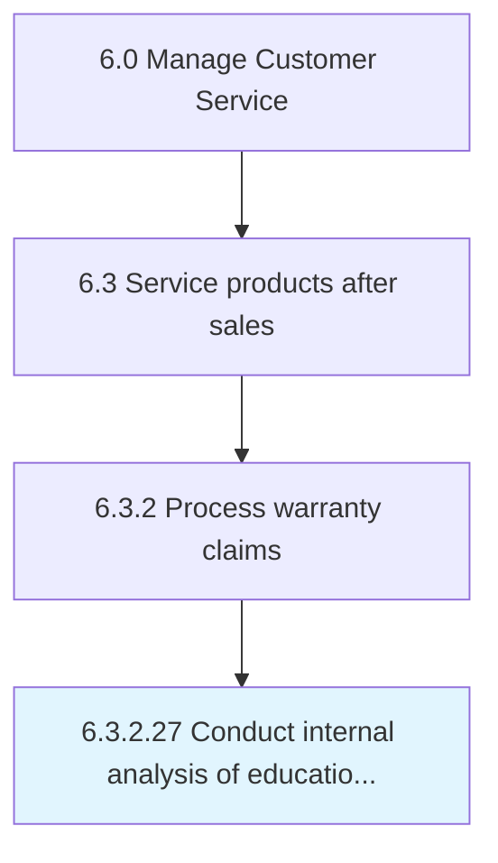

# Conduct internal analysis of educational programs, support, and operation services

## Overview

Activity 6.3.2.27 is an activity within the Manage Customer Service framework. 

## Process Hierarchy



## Key Statistics

| Metric | Value |
|--------|-------|
| APQC Code | 10019 |
| Hierarchy ID | 6.3.2.27 |
| Level | Activity |
| Parent | [6.3.2](../) |
| Sub-Processes | 0 |


## GraphDL Semantic Structure

```
conduct.InternalAnalysis.of.EducationalProgramsSupportAndOperationServices
```

| Component | Value | Description |
|-----------|-------|-------------|
| Verb | `conduct` | Primary action |
| Object | `internal analysis` | Direct object |
| Preposition | `of` | Relationship |
| PrepObject | `educational programs, support, and operation services` | Indirect object |


---

*Source: APQC PCF 10019 (6.3.2.27) - APQC*
