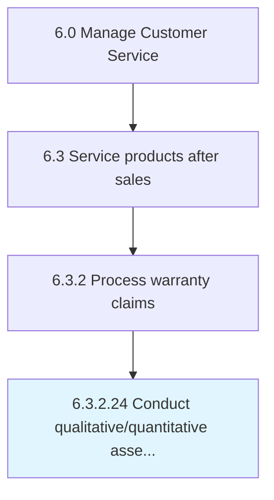

# Conduct qualitative/quantitative assessments

## Overview

Activity 6.3.2.24 is an activity within the Manage Customer Service framework. 

## Process Hierarchy



## Key Statistics

| Metric | Value |
|--------|-------|
| APQC Code | 10028 |
| Hierarchy ID | 6.3.2.24 |
| Level | Activity |
| Parent | [6.3.2](../) |
| Sub-Processes | 0 |


## GraphDL Semantic Structure

```
conduct.QualitativequantitativeAssessments
```

| Component | Value | Description |
|-----------|-------|-------------|
| Verb | `conduct` | Primary action |
| Object | `qualitative/quantitative assessments` | Direct object |


---

*Source: APQC PCF 10028 (6.3.2.24) - APQC*
