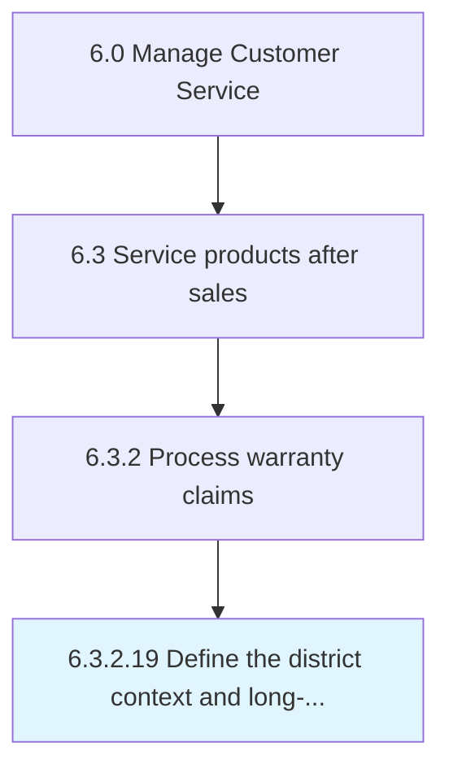

# Define the district context and long-term vision

## Overview

Activity 6.3.2.19 is an activity within the Manage Customer Service framework. 

## Process Hierarchy



## Key Statistics

| Metric | Value |
|--------|-------|
| APQC Code | 17040 |
| Hierarchy ID | 6.3.2.19 |
| Level | Activity |
| Parent | [6.3.2](../) |
| Sub-Processes | 0 |


## GraphDL Semantic Structure

```
define.TheDistrictContextAndLongtermVision
```

| Component | Value | Description |
|-----------|-------|-------------|
| Verb | `define` | Primary action |
| Object | `the district context and long-term vision` | Direct object |


---

*Source: APQC PCF 17040 (6.3.2.19) - APQC*
