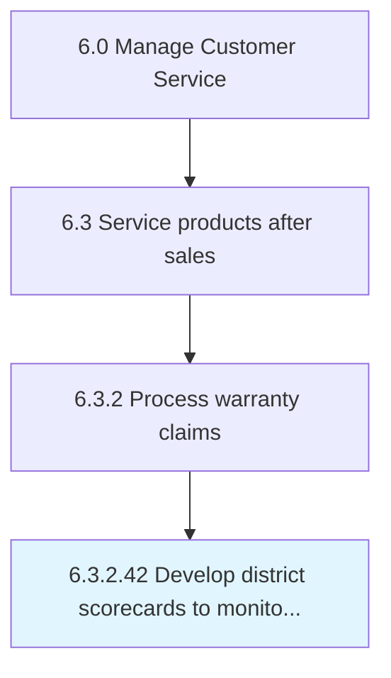

# Develop district scorecards to monitor and report performance

## Overview

Activity 6.3.2.42 is an activity within the Manage Customer Service framework. 

## Process Hierarchy



## Key Statistics

| Metric | Value |
|--------|-------|
| APQC Code | 19983 |
| Hierarchy ID | 6.3.2.42 |
| Level | Activity |
| Parent | [6.3.2](../) |
| Sub-Processes | 0 |


## GraphDL Semantic Structure

```
develop.DistrictScorecards.to.MonitorAndReportPerformance
```

| Component | Value | Description |
|-----------|-------|-------------|
| Verb | `develop` | Primary action |
| Object | `district scorecards` | Direct object |
| Preposition | `to` | Relationship |
| PrepObject | `monitor and report performance` | Indirect object |


---

*Source: APQC PCF 19983 (6.3.2.42) - APQC*
