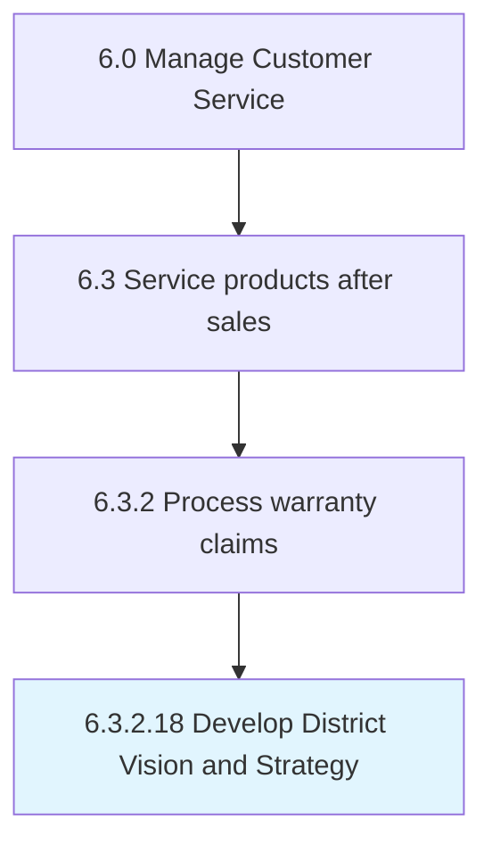

# Develop District Vision and Strategy

## Overview

Activity 6.3.2.18 is an activity within the Manage Customer Service framework. 

## Process Hierarchy



## Key Statistics

| Metric | Value |
|--------|-------|
| APQC Code | 10002 |
| Hierarchy ID | 6.3.2.18 |
| Level | Activity |
| Parent | [6.3.2](../) |
| Sub-Processes | 0 |


## GraphDL Semantic Structure

```
develop.DistrictVisionAndStrategy
```

| Component | Value | Description |
|-----------|-------|-------------|
| Verb | `develop` | Primary action |
| Object | `District Vision and Strategy` | Direct object |


---

*Source: APQC PCF 10002 (6.3.2.18) - APQC*
