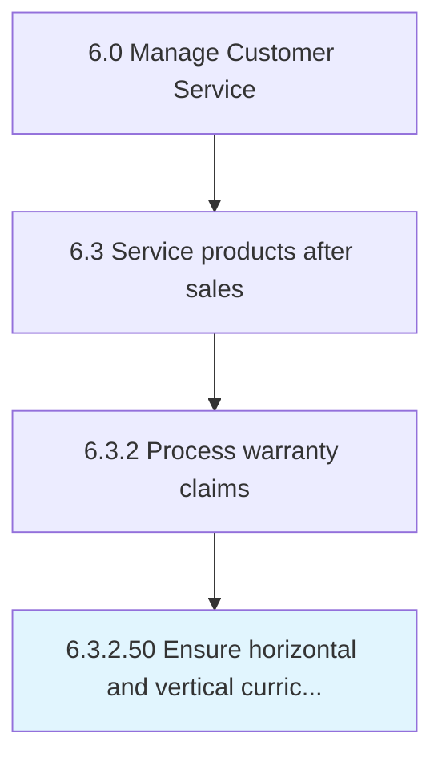

# Ensure horizontal and vertical curriculum alignment

## Overview

Activity 6.3.2.50 is an activity within the Manage Customer Service framework. 

## Process Hierarchy



## Key Statistics

| Metric | Value |
|--------|-------|
| APQC Code | 20198 |
| Hierarchy ID | 6.3.2.50 |
| Level | Activity |
| Parent | [6.3.2](../) |
| Sub-Processes | 0 |


## GraphDL Semantic Structure

```
ensure.HorizontalAndVerticalCurriculumAlignment
```

| Component | Value | Description |
|-----------|-------|-------------|
| Verb | `ensure` | Primary action |
| Object | `horizontal and vertical curriculum alignment` | Direct object |


---

*Source: APQC PCF 20198 (6.3.2.50) - APQC*
