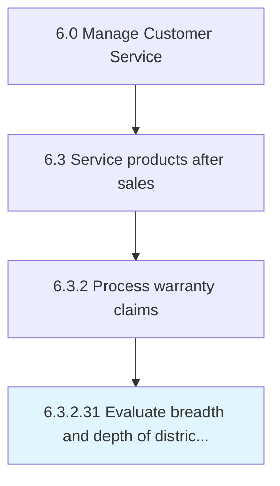

# Evaluate breadth and depth of district organizational structure

## Overview

Activity 6.3.2.31 is an activity within the Manage Customer Service framework. 

## Process Hierarchy



## Key Statistics

| Metric | Value |
|--------|-------|
| APQC Code | 10049 |
| Hierarchy ID | 6.3.2.31 |
| Level | Activity |
| Parent | [6.3.2](../) |
| Sub-Processes | 0 |


## GraphDL Semantic Structure

```
evaluate.BreadthAndDepth.of.DistrictOrganizationalStructure
```

| Component | Value | Description |
|-----------|-------|-------------|
| Verb | `evaluate` | Primary action |
| Object | `breadth and depth` | Direct object |
| Preposition | `of` | Relationship |
| PrepObject | `district organizational structure` | Indirect object |


---

*Source: APQC PCF 10049 (6.3.2.31) - APQC*
