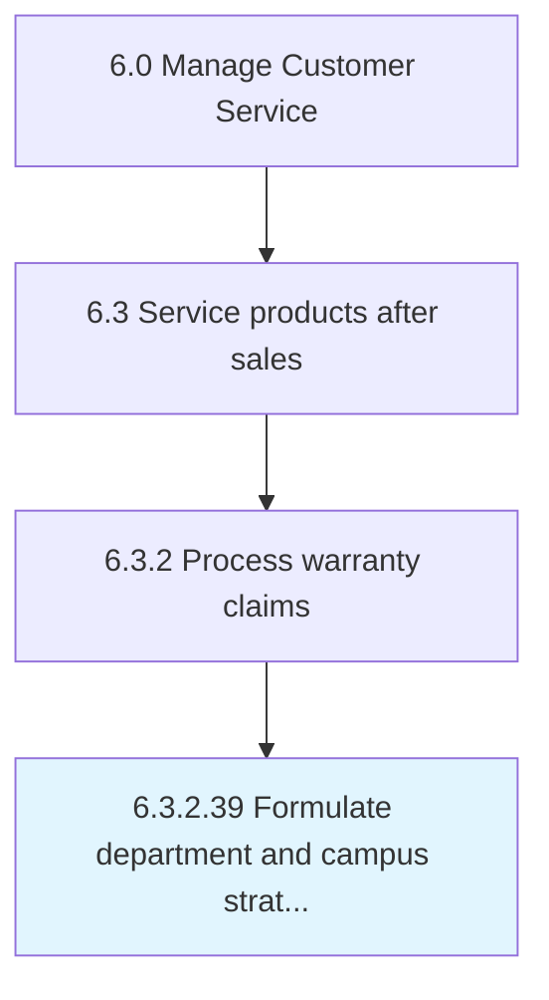

# Formulate department and campus strategies

## Overview

Activity 6.3.2.39 is an activity within the Manage Customer Service framework. 

## Process Hierarchy



## Key Statistics

| Metric | Value |
|--------|-------|
| APQC Code | 10043 |
| Hierarchy ID | 6.3.2.39 |
| Level | Activity |
| Parent | [6.3.2](../) |
| Sub-Processes | 0 |


## GraphDL Semantic Structure

```
formulate.DepartmentAndCampusStrategies
```

| Component | Value | Description |
|-----------|-------|-------------|
| Verb | `formulate` | Primary action |
| Object | `department and campus strategies` | Direct object |


---

*Source: APQC PCF 10043 (6.3.2.39) - APQC*
