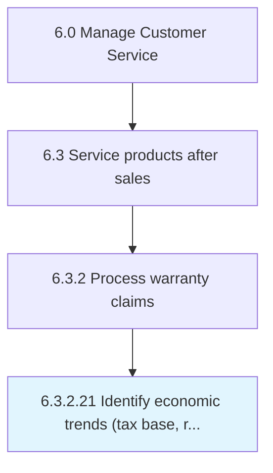

# Identify economic trends (tax base, revenue, state/federal funding and grants)

## Overview

Activity 6.3.2.21 is an activity within the Manage Customer Service framework. 

## Process Hierarchy



## Key Statistics

| Metric | Value |
|--------|-------|
| APQC Code | 10022 |
| Hierarchy ID | 6.3.2.21 |
| Level | Activity |
| Parent | [6.3.2](../) |
| Sub-Processes | 0 |


## GraphDL Semantic Structure

```
identify.EconomicTrendsTaxBaseRevenueStatefederalFundingAndGrants
```

| Component | Value | Description |
|-----------|-------|-------------|
| Verb | `identify` | Primary action |
| Object | `economic trends (tax base, revenue, state/federal funding and grants)` | Direct object |


---

*Source: APQC PCF 10022 (6.3.2.21) - APQC*
