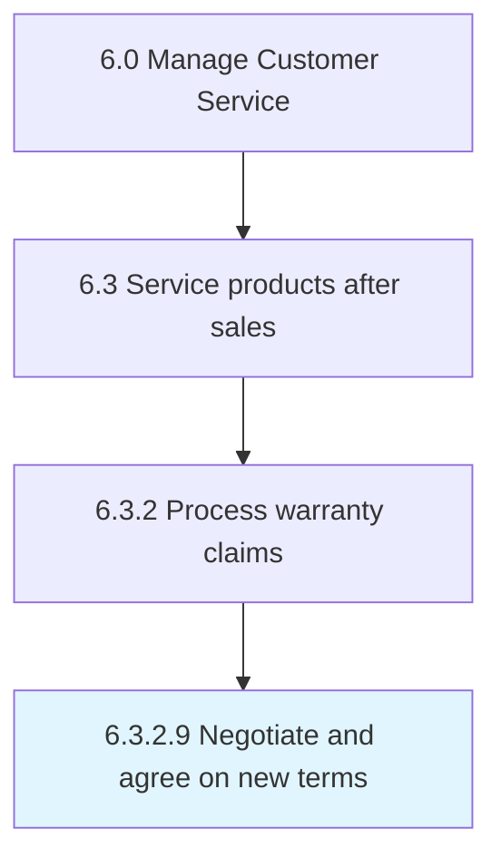

# Negotiate and agree on new terms

## Overview

Activity 6.3.2.9 is an activity within the Manage Customer Service framework. 

## Process Hierarchy



## Key Statistics

| Metric | Value |
|--------|-------|
| APQC Code | 13273 |
| Hierarchy ID | 6.3.2.9 |
| Level | Activity |
| Parent | [6.3.2](../) |
| Sub-Processes | 0 |


## GraphDL Semantic Structure

```
negotiate.AndAgree.on.NewTerms
```

| Component | Value | Description |
|-----------|-------|-------------|
| Verb | `negotiate` | Primary action |
| Object | `and agree` | Direct object |
| Preposition | `on` | Relationship |
| PrepObject | `new terms` | Indirect object |


---

*Source: APQC PCF 13273 (6.3.2.9) - APQC*
