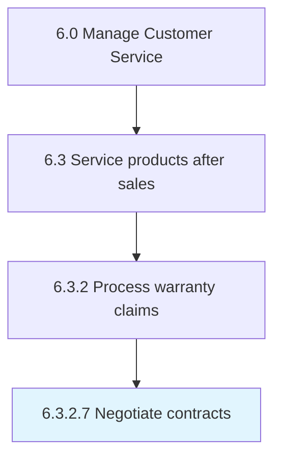

# Notify originator of approve/reject decision

> Contacting the originator of whether the warranty claim has been approved or rejected.

## Overview

Activity 6.3.2.7 is an activity within the Manage Customer Service framework. 

Contacting the originator of whether the warranty claim has been approved or rejected.

## Process Hierarchy



## Key Statistics

| Metric | Value |
|--------|-------|
| APQC Code | 20103 |
| Hierarchy ID | 6.3.2.7 |
| Level | Activity |
| Parent | [6.3.2](../) |
| Sub-Processes | 0 |


## GraphDL Semantic Structure

```
notify.Originator.of.ApproverejectDecision
```

| Component | Value | Description |
|-----------|-------|-------------|
| Verb | `notify` | Primary action |
| Object | `originator` | Direct object |
| Preposition | `of` | Relationship |
| PrepObject | `approve/reject decision` | Indirect object |


---

*Source: APQC PCF 20103 (6.3.2.7) - APQC*
