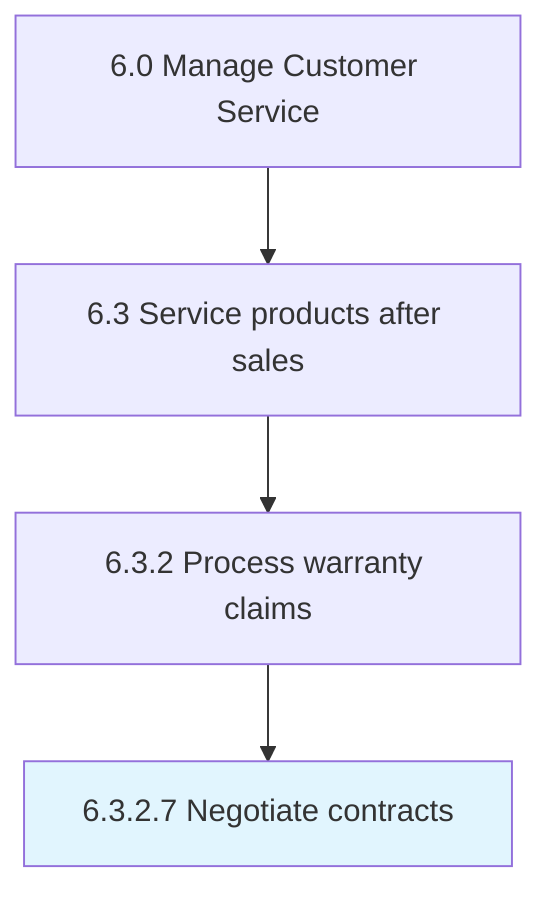
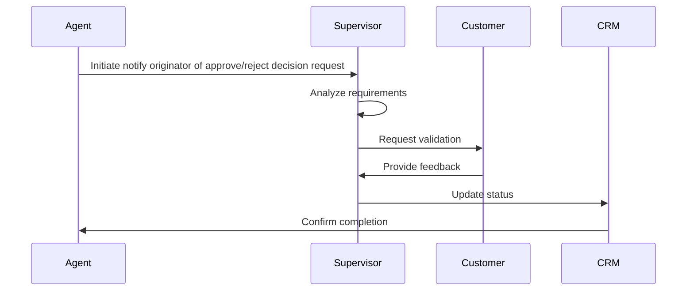

# Notify originator of approve/reject decision

> Contacting the originator of whether the warranty claim has been approved or rejected.

## Overview

This activity encompasses the end-to-end process of notify originator of approve/reject decision within the customer service and support domain. It involves coordinating cross-functional teams, applying standardized methodologies, and leveraging organizational data to ensure consistent and effective outcomes. The process is aligned with the broader Manage Customer Service framework (APQC 6.3.2.7) and supports strategic objectives by translating operational requirements into actionable procedures.

Effective execution of this activity requires clear ownership, well-defined inputs and outputs, and continuous monitoring against established benchmarks. Organizations that excel at this process typically integrate it with upstream planning activities and downstream performance measurement, creating a feedback loop that drives ongoing improvement and adaptation to changing business conditions.


## Process Hierarchy



## Key Statistics

| Metric | Value |
|--------|-------|
| APQC Code | 20103 |
| Hierarchy ID | 6.3.2.7 |
| Level | Activity |
| Parent | [6.3.2](../) |
| Sub-Processes | 0 |


## Process Overview

Customer service processes manage customer inquiries, complaints, and support to ensure customer satisfaction. This process focuses on notify originator of approve/reject decision, which is essential for organizational effectiveness and achieving business objectives.

## Key Metrics

| Metric | Description | Target |
|--------|-------------|--------|
| Customer satisfaction score | Measure of customer satisfaction score | Target varies by organization |
| First contact resolution | Measure of first contact resolution | Target varies by organization |
| Average handle time | Measure of average handle time | Target varies by organization |
| Net promoter score | Measure of net promoter score | Target varies by organization |

## Related Departments

- [Customer Service](/departments/Customer Service)
- [Support](/departments/Support)
- [Quality](/departments/Quality)

## Related Occupations

- [Customer Service Managers](/occupations/Management/CustomerServiceManagers)
- [Customer Service Representatives](/occupations/Administrative/CustomerServiceRepresentatives)
- [Quality Assurance Specialists](/occupations/Production/QualityControlInspectors)

## RACI Matrix

| Activity | Responsible | Accountable | Consulted | Informed |
|----------|-------------|-------------|-----------|----------|
| Plan | Process Owner | Manager | Stakeholders | Team |
| Execute | Team | Process Owner | Manager | Stakeholders |
| Monitor | Analyst | Manager | Process Owner | Leadership |
| Improve | Process Owner | Manager | Team | Stakeholders |

## GraphDL Semantic Structure

```graphdl
notify.Originator.of.ApproverejectDecision
```

| Component | Value | Description |
|-----------|-------|-------------|
| Verb | `notify` | Primary action |
| Object | `originator` | Direct object |
| Preposition | `of` | Relationship |
| PrepObject | `approve/reject decision` | Indirect object |


## Process Sequence


---

*Source: APQC PCF 20103 (6.3.2.7) - APQC*
