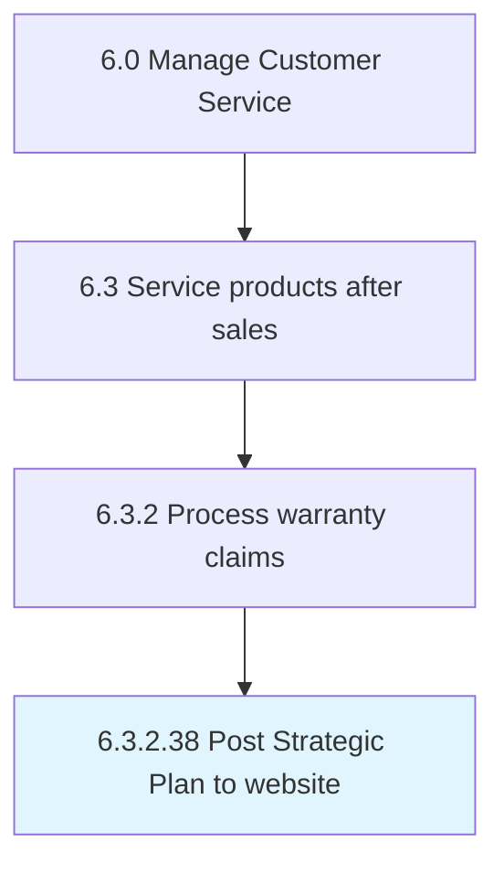

# Post Strategic Plan to website

## Overview

Activity 6.3.2.38 is an activity within the Manage Customer Service framework. 

## Process Hierarchy



## Key Statistics

| Metric | Value |
|--------|-------|
| APQC Code | 20191 |
| Hierarchy ID | 6.3.2.38 |
| Level | Activity |
| Parent | [6.3.2](../) |
| Sub-Processes | 0 |


## GraphDL Semantic Structure

```
post.StrategicPlan.to.Website
```

| Component | Value | Description |
|-----------|-------|-------------|
| Verb | `post` | Primary action |
| Object | `Strategic Plan` | Direct object |
| Preposition | `to` | Relationship |
| PrepObject | `website` | Indirect object |


---

*Source: APQC PCF 20191 (6.3.2.38) - APQC*
