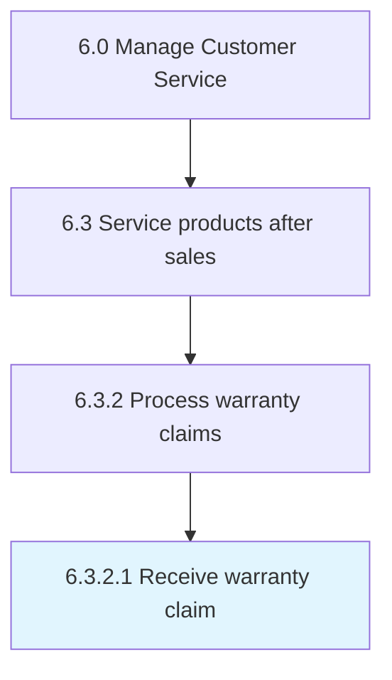

# Receive warranty claim

> Receiving incoming warranty claims.

## Overview

Activity 6.3.2.1 is an activity within the Manage Customer Service framework. 

Receiving incoming warranty claims. Route claim to correct department. Document claim.

## Process Hierarchy



## Key Statistics

| Metric | Value |
|--------|-------|
| APQC Code | 20096 |
| Hierarchy ID | 6.3.2.1 |
| Level | Activity |
| Parent | [6.3.2](../) |
| Sub-Processes | 0 |


## GraphDL Semantic Structure

```
receive.WarrantyClaim
```

| Component | Value | Description |
|-----------|-------|-------------|
| Verb | `receive` | Primary action |
| Object | `warranty claim` | Direct object |


## Related Concepts

- WarrantyClaim


---

*Source: APQC PCF 20096 (6.3.2.1) - APQC*
