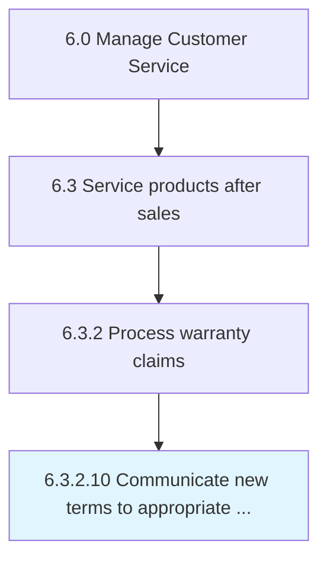

# Reconcile warranty transaction disposition

> Assuring that the warranty transaction has been completed.

## Overview

Activity 6.3.2.10 is an activity within the Manage Customer Service framework. 

Assuring that the warranty transaction has been completed.

## Process Hierarchy



## Key Statistics

| Metric | Value |
|--------|-------|
| APQC Code | 12667 |
| Hierarchy ID | 6.3.2.10 |
| Level | Activity |
| Parent | [6.3.2](../) |
| Sub-Processes | 0 |


## GraphDL Semantic Structure

```
reconcile.WarrantyTransactionDisposition
```

| Component | Value | Description |
|-----------|-------|-------------|
| Verb | `reconcile` | Primary action |
| Object | `warranty transaction disposition` | Direct object |


---

*Source: APQC PCF 12667 (6.3.2.10) - APQC*
