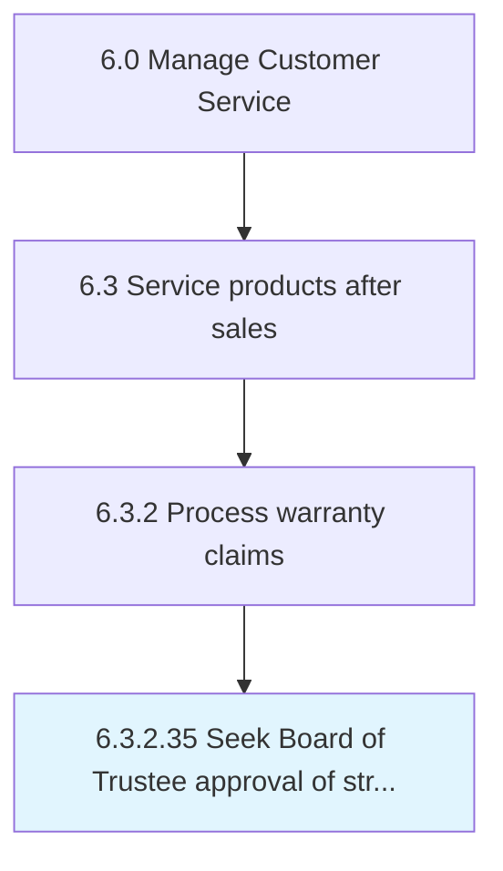

# Seek Board of Trustee approval of strategy and strategic plan

## Overview

Activity 6.3.2.35 is an activity within the Manage Customer Service framework. 

## Process Hierarchy



## Key Statistics

| Metric | Value |
|--------|-------|
| APQC Code | 20188 |
| Hierarchy ID | 6.3.2.35 |
| Level | Activity |
| Parent | [6.3.2](../) |
| Sub-Processes | 0 |


## GraphDL Semantic Structure

```
seek.Board.of.TrusteeApprovalOfStrategyAndStrategicPlan
```

| Component | Value | Description |
|-----------|-------|-------------|
| Verb | `seek` | Primary action |
| Object | `Board` | Direct object |
| Preposition | `of` | Relationship |
| PrepObject | `Trustee approval of strategy and strategic plan` | Indirect object |


---

*Source: APQC PCF 20188 (6.3.2.35) - APQC*
