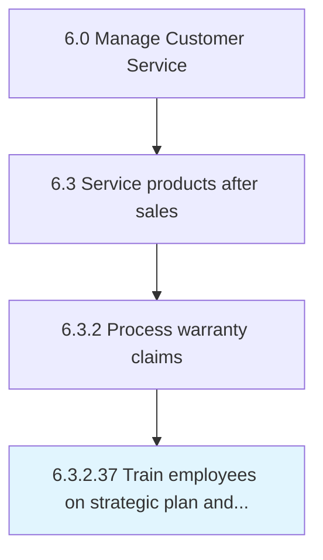

# Train employees on strategic plan and alignment with department and campus plans

## Overview

Activity 6.3.2.37 is an activity within the Manage Customer Service framework. 

## Process Hierarchy



## Key Statistics

| Metric | Value |
|--------|-------|
| APQC Code | 20190 |
| Hierarchy ID | 6.3.2.37 |
| Level | Activity |
| Parent | [6.3.2](../) |
| Sub-Processes | 0 |


## GraphDL Semantic Structure

```
train.Employees.on.StrategicPlanAndAlignmentWithDepartmentAndCampusPlans
```

| Component | Value | Description |
|-----------|-------|-------------|
| Verb | `train` | Primary action |
| Object | `employees` | Direct object |
| Preposition | `on` | Relationship |
| PrepObject | `strategic plan and alignment with department and campus plans` | Indirect object |


---

*Source: APQC PCF 20190 (6.3.2.37) - APQC*
