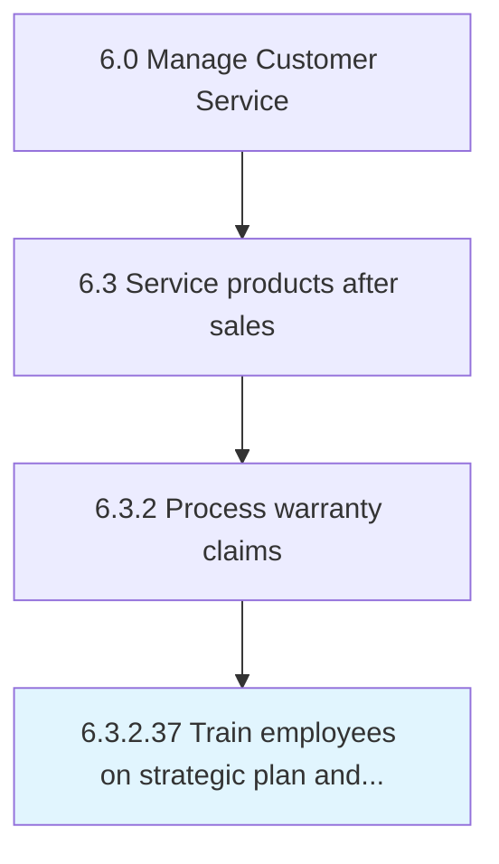

# Train employees on strategic plan and alignment with department and campus plans

## Overview

This activity encompasses the end-to-end process of train employees on strategic plan and alignment with department and campus plans within the customer service and support domain. It involves coordinating cross-functional teams, applying standardized methodologies, and leveraging organizational data to ensure consistent and effective outcomes. The process is aligned with the broader Manage Customer Service framework (APQC 6.3.2.37) and supports strategic objectives by translating operational requirements into actionable procedures.

Effective execution of this activity requires clear ownership, well-defined inputs and outputs, and continuous monitoring against established benchmarks. Organizations that excel at this process typically integrate it with upstream planning activities and downstream performance measurement, creating a feedback loop that drives ongoing improvement and adaptation to changing business conditions.


## Process Hierarchy



## Key Statistics

| Metric | Value |
|--------|-------|
| APQC Code | 20190 |
| Hierarchy ID | 6.3.2.37 |
| Level | Activity |
| Parent | [6.3.2](../) |
| Sub-Processes | 0 |


## GraphDL Semantic Structure

```
train.Employees.on.StrategicPlanAndAlignmentWithDepartmentAndCampusPlans
```

| Component | Value | Description |
|-----------|-------|-------------|
| Verb | `train` | Primary action |
| Object | `employees` | Direct object |
| Preposition | `on` | Relationship |
| PrepObject | `strategic plan and alignment with department and campus plans` | Indirect object |


---

*Source: APQC PCF 20190 (6.3.2.37) - APQC*
