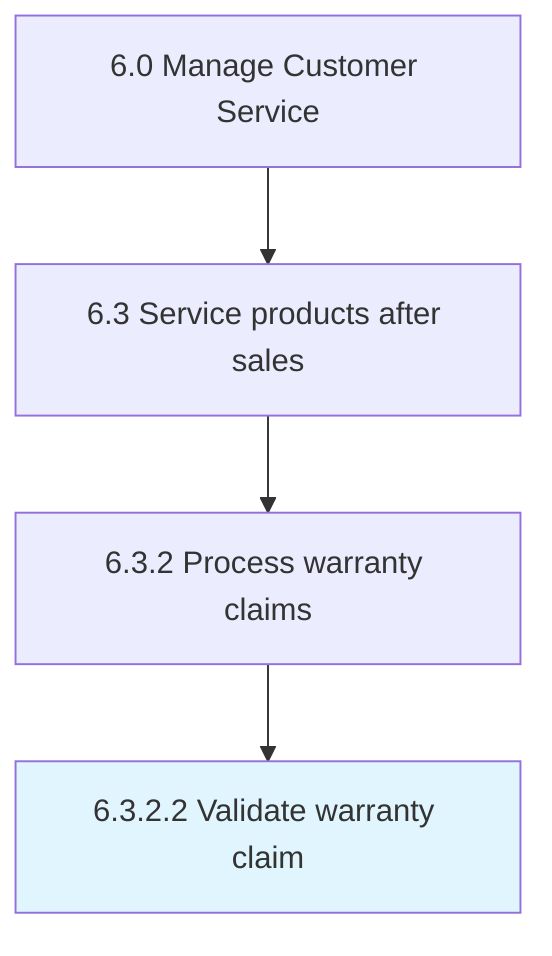

# Validate warranty claim

> Ensuring that the claim falls within the parameters of the warranty in question.

## Overview

Activity 6.3.2.2 is an activity within the Manage Customer Service framework. 

Ensuring that the claim falls within the parameters of the warranty in question. After validation is made, the claim must be investigated.

## Process Hierarchy



## Key Statistics

| Metric | Value |
|--------|-------|
| APQC Code | 12671 |
| Hierarchy ID | 6.3.2.2 |
| Level | Activity |
| Parent | [6.3.2](../) |
| Sub-Processes | 0 |


## GraphDL Semantic Structure

```
validate.WarrantyClaim
```

| Component | Value | Description |
|-----------|-------|-------------|
| Verb | `validate` | Primary action |
| Object | `warranty claim` | Direct object |


## Related Concepts

- WarrantyClaim


---

*Source: APQC PCF 12671 (6.3.2.2) - APQC*
