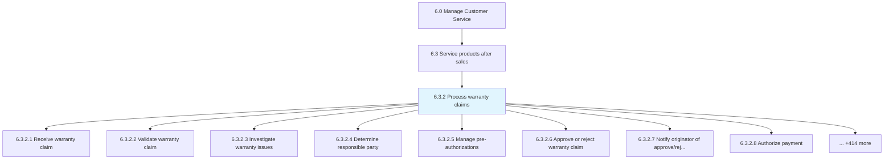
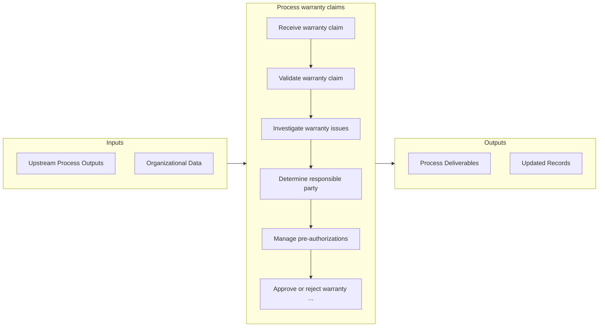

# Process warranty claims

> Identifying, investigating, and processes warranty claims.

## Overview

Process 6.3.2 is a core process that defines the specific procedures for process warranty claims. 

Identifying, investigating, and processes warranty claims. This process includes: receipt and validation of a warranty claim; definition and diagnosis /root cause analysis of an issue and recommendation for corrective action; the determination of responsibility for settlement of the claim; the transaction being approved or denied; and the originator being notified and payment authorized. In the case of a recurring event, further investigation (definition and diagnosis or root cause analysis) is performed, and a recommendation for corrective action is made and implemented in production/design. It ends when the claim is closed.

## Process Hierarchy



## Key Statistics

| Metric | Value |
|--------|-------|
| APQC Code | 12669 |
| Hierarchy ID | 6.3.2 |
| Level | Process |
| Parent | [6.3](../) |
| Sub-Processes | 422 |


## GraphDL Semantic Structure

```
process.WarrantyClaims
```

| Component | Value | Description |
|-----------|-------|-------------|
| Verb | `process` | Primary action |
| Object | `warranty claims` | Direct object |


## Process Flow



## Sub-Processes

| Process | Hierarchy ID | Description |
|---------|-------------|-------------|
| [Receive warranty claim](./ReceiveWarrantyClaim) | 6.3.2.1 | Receiving incoming warranty claims |
| [Validate warranty claim](./ValidateWarrantyClaim) | 6.3.2.2 | Ensuring that the claim falls within the parameters of the warranty in question |
| [Investigate warranty issues](./6.3.2.3-InvestigateWarrantyIssues/) | 6.3.2.3 | Executing investigational and analysis of warranty claims |
| [Determine responsible party](./DetermineResponsibleParty) | 6.3.2.4 | Identifying responsible party for a claim |
| [Manage pre-authorizations](./ManagePreauthorizations) | 6.3.2.5 | Authorizing claims prior to submittal |
| [Approve or reject warranty claim](./ApproveOrRejectWarrantyClaim) | 6.3.2.6 | Following Defining issue [20098], an approval or rejection with be made against the warranty claim |
| [Notify originator of approve/reject decision](./NotifyOriginatorOfApproverejectDecision) | 6.3.2.7 | Contacting the originator of whether the warranty claim has been approved or rejected |
| [Authorize payment](./AuthorizePayment) | 6.3.2.8 | Allowing for a payment to be made to the claimant |
| [Close claim](./CloseClaim) | 6.3.2.9 | Archiving and closing the warranty claim after a final decision has been made to either approve or r |
| [Reconcile warranty transaction disposition](./ReconcileWarrantyTransactionDisposition) | 6.3.2.10 | Assuring that the warranty transaction has been completed |
| [Manage preauthorizations](./ManagePreauthorizations) | 6.3.2.5 | Authorizing claims prior to submittal |
| [Manage union relations](./ManageUnionRelations) | 6.3.2.6 | Manage union relations |
| [Negotiate contracts](./NegotiateContracts) | 6.3.2.7 | Negotiate contracts |
| [Analyze terms](./AnalyzeTerms) | 6.3.2.8 | Analyze terms |
| [Negotiate and agree on new terms](./NegotiateAndAgreeOnNewTerms) | 6.3.2.9 | Negotiate and agree on new terms |
| [Communicate new terms to appropriate parties](./CommunicateNewTermsToAppropriateParties) | 6.3.2.10 | Communicate new terms to appropriate parties |
| [Manage and administer labor contracts](./ManageAndAdministerLaborContracts) | 6.3.2.11 | Manage and administer labor contracts |
| [Manage wage administration including monthly rate changes](./ManageWageAdministrationIncludingMonthlyRateChanges) | 6.3.2.12 | Manage wage administration including monthly rate changes |
| [Manage labor grievances](./ManageLaborGrievances) | 6.3.2.13 | Manage labor grievances |
| [Conduct strike management](./ConductStrikeManagement) | 6.3.2.14 | Conduct strike management |
| [Manage employee discipline](./ManageEmployeeDiscipline) | 6.3.2.15 | Manage employee discipline |
| [Manage performance appraisal](./ManagePerformanceAppraisal) | 6.3.2.16 | Manage performance appraisal |
| [Manage field labor training](./ManageFieldLaborTraining) | 6.3.2.17 | Manage field labor training |
| [Develop District Vision and Strategy](./DevelopDistrictVisionAndStrategy) | 6.3.2.18 | Develop District Vision and Strategy |
| [Define the district context and long-term vision](./DefineTheDistrictContextAndLongtermVision) | 6.3.2.19 | Define the district context and long-term vision |
| [Analyze and evaluate competition (surrounding districts, private and charter schools, virtual schools, etc..)](./AnalyzeAndEvaluateCompetitionSurroundingDistrictsPrivateAndCharterSchoolsVirtualSchoolsEtc) | 6.3.2.20 | Analyze and evaluate competition (surrounding districts, private and charter schools, virtual schools, etc..) |
| [Identify economic trends (tax base, revenue, state/federal funding and grants)](./IdentifyEconomicTrendsTaxBaseRevenueStatefederalFundingAndGrants) | 6.3.2.21 | Identify economic trends (tax base, revenue, state/federal funding and grants) |
| [Assess new technology innovations (instructional, administrative, and operational)](./AssessNewTechnologyInnovationsInstructionalAdministrativeAndOperational) | 6.3.2.22 | Assess new technology innovations (instructional, administrative, and operational) |
| [Survey stakeholders and determine customer needs and requirements](./SurveyStakeholdersAndDetermineCustomerNeedsAndRequirements) | 6.3.2.23 | Survey stakeholders and determine customer needs and requirements |
| [Conduct qualitative/quantitative assessments](./ConductQualitativequantitativeAssessments) | 6.3.2.24 | Conduct qualitative/quantitative assessments |
| [Capture student and stakeholder needs](./CaptureStudentAndStakeholderNeeds) | 6.3.2.25 | Capture student and stakeholder needs |
| [Assess student and stakeholder needs](./AssessStudentAndStakeholderNeeds) | 6.3.2.26 | Assess student and stakeholder needs |
| [Conduct internal analysis of educational programs, support, and operation services](./ConductInternalAnalysisOfEducationalProgramsSupportAndOperationServices) | 6.3.2.27 | Conduct internal analysis of educational programs, support, and operation services |
| [Identify (district) core competencies](./IdentifyDistrictCoreCompetencies) | 6.3.2.28 | Identify (district) core competencies |
| [Develop district strategy](./DevelopDistrictStrategy) | 6.3.2.29 | Develop district strategy |
| [Select long-term district strategy](./SelectLongtermDistrictStrategy) | 6.3.2.30 | Select long-term district strategy |
| [Evaluate breadth and depth of district organizational structure](./EvaluateBreadthAndDepthOfDistrictOrganizationalStructure) | 6.3.2.31 | Evaluate breadth and depth of district organizational structure |
| [Evaluate operations and instructional staffing needs](./EvaluateOperationsAndInstructionalStaffingNeeds) | 6.3.2.32 | Evaluate operations and instructional staffing needs |
| [Assess organizational implication of staffing](./AssessOrganizationalImplicationOfStaffing) | 6.3.2.33 | Assess organizational implication of staffing |
| [Develop and set district goals](./DevelopAndSetDistrictGoals) | 6.3.2.34 | Develop and set district goals |
| [Seek Board of Trustee approval of strategy and strategic plan](./SeekBoardOfTrusteeApprovalOfStrategyAndStrategicPlan) | 6.3.2.35 | Seek Board of Trustee approval of strategy and strategic plan |
| [Communicate and share strategic plan with all staff](./CommunicateAndShareStrategicPlanWithAllStaff) | 6.3.2.36 | Communicate and share strategic plan with all staff |
| [Train employees on strategic plan and alignment with department and campus plans](./TrainEmployeesOnStrategicPlanAndAlignmentWithDepartmentAndCampusPlans) | 6.3.2.37 | Train employees on strategic plan and alignment with department and campus plans |
| [Post Strategic Plan to website](./PostStrategicPlanToWebsite) | 6.3.2.38 | Post Strategic Plan to website |
| [Formulate department and campus strategies](./FormulateDepartmentAndCampusStrategies) | 6.3.2.39 | Formulate department and campus strategies |
| [Analyze department and campus strategies to district](./AnalyzeDepartmentAndCampusStrategiesToDistrict) | 6.3.2.40 | Analyze department and campus strategies to district |
| [Establish high-level performance measures](./EstablishHighlevelPerformanceMeasures) | 6.3.2.41 | Establish high-level performance measures |
| [Develop district scorecards to monitor and report performance](./DevelopDistrictScorecardsToMonitorAndReportPerformance) | 6.3.2.42 | Develop district scorecards to monitor and report performance |
| [Align department and campus performance measures to district level measures](./AlignDepartmentAndCampusPerformanceMeasuresToDistrictLevelMeasures) | 6.3.2.43 | Align department and campus performance measures to district level measures |
| [Develop, Deliver, and Assess Curriculum, Assessment, and Instruction](./DevelopDeliverAndAssessCurriculumAssessmentAndInstruction) | 6.3.2.44 | Develop, Deliver, and Assess Curriculum, Assessment, and Instruction |
| [Develop curriculum](./DevelopCurriculum) | 6.3.2.45 | Develop curriculum |
| [Define/Design curriculum development procedures](./DefineDesignCurriculumDevelopmentProcedures) | 6.3.2.46 | Define/Design curriculum development procedures |
| [Align with federal/state/local standards](./AlignWithFederalstatelocalStandards) | 6.3.2.47 | Align with federal/state/local standards |
| [Align with content standards developed by national organizations](./AlignWithContentStandardsDevelopedByNationalOrganizations) | 6.3.2.48 | Align with content standards developed by national organizations |
| [Align to assessment performance standards](./AlignToAssessmentPerformanceStandards) | 6.3.2.49 | Align to assessment performance standards |
| [Ensure horizontal and vertical curriculum alignment](./EnsureHorizontalAndVerticalCurriculumAlignment) | 6.3.2.50 | Ensure horizontal and vertical curriculum alignment |
| [Identify and review best practice research](./IdentifyAndReviewBestPracticeResearch) | 6.3.2.51 | Identify and review best practice research |
| [Provide for key customer and stakeholder input](./ProvideForKeyCustomerAndStakeholderInput) | 6.3.2.52 | Provide for key customer and stakeholder input |
| [Develop scope/sequence/timeline](./DevelopScopesequencetimeline) | 6.3.2.53 | Develop scope/sequence/timeline |
| [Develop instructional calendars/pacing guides/local assessments](./DevelopInstructionalCalendarspacingGuideslocalAssessments) | 6.3.2.54 | Develop instructional calendars/pacing guides/local assessments |
| [Select instructional resources](./SelectInstructionalResources) | 6.3.2.55 | Select instructional resources |
| [Develop instructional materials plan](./DevelopInstructionalMaterialsPlan) | 6.3.2.56 | Develop instructional materials plan |
| [Form cross-functional team including curriculum and instruction, technology, procurement office](./FormCrossfunctionalTeamIncludingCurriculumAndInstructionTechnologyProcurementOffice) | 6.3.2.57 | Form cross-functional team including curriculum and instruction, technology, procurement office |
| [Create overall plan](./CreateOverallPlan) | 6.3.2.58 | Create overall plan |
| [Collaborate with suppliers and contractors](./CollaborateWithSuppliersAndContractors) | 6.3.2.59 | Collaborate with suppliers and contractors |
| [Coordinate implementation plan](./CoordinateImplementationPlan) | 6.3.2.60 | Coordinate implementation plan |
| [Pilot the curriculum](./PilotTheCurriculum) | 6.3.2.61 | Pilot the curriculum |
| [Evaluate effectiveness of curriculum](./EvaluateEffectivenessOfCurriculum) | 6.3.2.62 | Evaluate effectiveness of curriculum |
| [Revise curriculum based on feedback and local assessments](./ReviseCurriculumBasedOnFeedbackAndLocalAssessments) | 6.3.2.63 | Revise curriculum based on feedback and local assessments |
| [Implement curriculum](./ImplementCurriculum) | 6.3.2.64 | Implement curriculum |
| [Monitor integrity of curriculum implementation](./MonitorIntegrityOfCurriculumImplementation) | 6.3.2.65 | Monitor integrity of curriculum implementation |
| [Design effective instructional programs](./DesignEffectiveInstructionalPrograms) | 6.3.2.66 | Design effective instructional programs |
| [Use diagnostics to determine readiness to learn](./UseDiagnosticsToDetermineReadinessToLearn) | 6.3.2.67 | Use diagnostics to determine readiness to learn |
| [Use formative assessment to inform ongoing instruction](./UseFormativeAssessmentToInformOngoingInstruction) | 6.3.2.68 | Use formative assessment to inform ongoing instruction |
| [Determine students’ readiness to learn](./DetermineStudentsReadinessToLearn) | 6.3.2.69 | Determine students’ readiness to learn |
| [Identify best practices based on data](./IdentifyBestPracticesBasedOnData) | 6.3.2.70 | Identify best practices based on data |
| [Document and share best practices](./DocumentAndShareBestPractices) | 6.3.2.71 | Document and share best practices |
| [Establish best-practice instructional strategies](./EstablishBestpracticeInstructionalStrategies) | 6.3.2.72 | Establish best-practice instructional strategies |
| [Engage students in the instructional process](./EngageStudentsInTheInstructionalProcess) | 6.3.2.73 | Engage students in the instructional process |
| [Develop an implementation plan](./DevelopAnImplementationPlan) | 6.3.2.74 | Develop an implementation plan |
| [Determine expectation for lesson design](./DetermineExpectationForLessonDesign) | 6.3.2.75 | Determine expectation for lesson design |
| [Determine district expectations](./DetermineDistrictExpectations) | 6.3.2.76 | Determine district expectations |
| [Determine campus expectations](./DetermineCampusExpectations) | 6.3.2.77 | Determine campus expectations |
| [Determine level and rigor of instruction expectations](./DetermineLevelAndRigorOfInstructionExpectations) | 6.3.2.78 | Determine level and rigor of instruction expectations |
| [Provide differentiated instruction based on individual student needs](./ProvideDifferentiatedInstructionBasedOnIndividualStudentNeeds) | 6.3.2.79 | Provide differentiated instruction based on individual student needs |
| [Identify enrichment needs](./IdentifyEnrichmentNeeds) | 6.3.2.80 | Identify enrichment needs |
| [Identify acceleration needs](./IdentifyAccelerationNeeds) | 6.3.2.81 | Identify acceleration needs |
| [Identify technology for program needs](./IdentifyTechnologyForProgramNeeds) | 6.3.2.82 | Identify technology for program needs |
| [Align after school and summer program curriculum](./AlignAfterSchoolAndSummerProgramCurriculum) | 6.3.2.83 | Align after school and summer program curriculum |
| [Design instructional programs to accelerate learning for students below grade level standards](./DesignInstructionalProgramsToAccelerateLearningForStudentsBelowGradeLevelStandards) | 6.3.2.84 | Design instructional programs to accelerate learning for students below grade level standards |
| [Plan for remedial instruction](./PlanForRemedialInstruction) | 6.3.2.85 | Plan for remedial instruction |
| [Manage the classroom for differentiated instructional strategies](./ManageTheClassroomForDifferentiatedInstructionalStrategies) | 6.3.2.86 | Manage the classroom for differentiated instructional strategies |
| [Provide academic coaches to support classroom instruction for students](./ProvideAcademicCoachesToSupportClassroomInstructionForStudents) | 6.3.2.87 | Provide academic coaches to support classroom instruction for students |
| [Assess student achievement](./AssessStudentAchievement) | 6.3.2.88 | Assess student achievement |
| [Plan district assessment program](./PlanDistrictAssessmentProgram) | 6.3.2.89 | Plan district assessment program |
| [Assess current assessment program](./AssessCurrentAssessmentProgram) | 6.3.2.90 | Assess current assessment program |
| [Determine goal of the assessment program in school or system improvement](./DetermineGoalOfTheAssessmentProgramInSchoolOrSystemImprovement) | 6.3.2.91 | Determine goal of the assessment program in school or system improvement |
| [Identify mandatory testing by local, district, state, and federal agencies](./IdentifyMandatoryTestingByLocalDistrictStateAndFederalAgencies) | 6.3.2.92 | Identify mandatory testing by local, district, state, and federal agencies |
| [Identify diagnostic, formative, and any voluntary assessment for program](./IdentifyDiagnosticFormativeAndAnyVoluntaryAssessmentForProgram) | 6.3.2.93 | Identify diagnostic, formative, and any voluntary assessment for program |
| [Determine target populations of current assessments](./DetermineTargetPopulationsOfCurrentAssessments) | 6.3.2.94 | Determine target populations of current assessments |
| [Analyze current frequency and scheduling of assessments](./AnalyzeCurrentFrequencyAndSchedulingOfAssessments) | 6.3.2.95 | Analyze current frequency and scheduling of assessments |
| [Identify gaps in the assessment program; check for alignment](./IdentifyGapsInTheAssessmentProgramCheckForAlignment) | 6.3.2.96 | Identify gaps in the assessment program; check for alignment |
| [Design assessment program](./DesignAssessmentProgram) | 6.3.2.97 | Design assessment program |
| [Determine learning (skills) to be assessed](./DetermineLearningSkillsToBeAssessed) | 6.3.2.98 | Determine learning (skills) to be assessed |
| [Determine performance standards for target populations](./DeterminePerformanceStandardsForTargetPopulations) | 6.3.2.99 | Determine performance standards for target populations |
| [Select most appropriate format](./SelectMostAppropriateFormat) | 6.3.2.100 | Select most appropriate format |
| [Select vendor-developed assessment or develop the assessment](./SelectVendordevelopedAssessmentOrDevelopTheAssessment) | 6.3.2.101 | Select vendor-developed assessment or develop the assessment |
| [Develop formative assessment tools](./DevelopFormativeAssessmentTools) | 6.3.2.102 | Develop formative assessment tools |
| [Determine the scope of content and skills to be addressed](./DetermineTheScopeOfContentAndSkillsToBeAddressed) | 6.3.2.103 | Determine the scope of content and skills to be addressed |
| [Determine assessment method for each objective (multiple choice, open-ended, essay, performance, portfolio, etc..)](./DetermineAssessmentMethodForEachObjectiveMultipleChoiceOpenendedEssayPerformancePortfolioEtc) | 6.3.2.104 | Determine assessment method for each objective (multiple choice, open-ended, essay, performance, portfolio, etc..) |
| [Determine appropriate delivery format (paper/pencil, online, oral administration, etc..)](./DetermineAppropriateDeliveryFormatPaperpencilOnlineOralAdministrationEtc) | 6.3.2.105 | Determine appropriate delivery format (paper/pencil, online, oral administration, etc..) |
| [Develop blueprint for test development, including number and format of items or tasks for each objective or strand](./DevelopBlueprintForTestDevelopmentIncludingNumberAndFormatOfItemsOrTasksForEachObjectiveOrStrand) | 6.3.2.106 | Develop blueprint for test development, including number and format of items or tasks for each objective or strand |
| [Develop test item specifications (number of distracters, level of vocabulary, level of thinking or mental processing, performance required)](./DevelopTestItemSpecificationsNumberOfDistractersLevelOfVocabularyLevelOfThinkingOrMentalProcessingPerformanceRequired) | 6.3.2.107 | Develop test item specifications (number of distracters, level of vocabulary, level of thinking or mental processing, performance required) |
| [Develop rubrics that outline requirements for successful response and scoring criteria for performance tasks and open-ended items](./DevelopRubricsThatOutlineRequirementsForSuccessfulResponseAndScoringCriteriaForPerformanceTasksAndOpenendedItems) | 6.3.2.108 | Develop rubrics that outline requirements for successful response and scoring criteria for performance tasks and open-ended items |
| [Develop items or tasks (locally or contractor)](./DevelopItemsOrTasksLocallyOrContractor) | 6.3.2.109 | Develop items or tasks (locally or contractor) |
| [Review items for content/ adherence to blueprint and item specifications by peer review](./ReviewItemsForContentAdherenceToBlueprintAndItemSpecificationsByPeerReview) | 6.3.2.110 | Review items for content/ adherence to blueprint and item specifications by peer review |
| [Develop key or refine rubrics as necessary](./DevelopKeyOrRefineRubricsAsNecessary) | 6.3.2.111 | Develop key or refine rubrics as necessary |
| [Review items for sensitivity and bias](./ReviewItemsForSensitivityAndBias) | 6.3.2.112 | Review items for sensitivity and bias |
| [Pilot items or tasks](./PilotItemsOrTasks) | 6.3.2.113 | Pilot items or tasks |
| [Review and pilot completed assessment](./ReviewAndPilotCompletedAssessment) | 6.3.2.114 | Review and pilot completed assessment |
| [Revise as needed](./ReviseAsNeeded) | 6.3.2.115 | Revise as needed |
| [Administer formative assessments](./AdministerFormativeAssessments) | 6.3.2.116 | Administer formative assessments |
| [Provide necessary training](./ProvideNecessaryTraining) | 6.3.2.117 | Provide necessary training |
| [Distribute the tests or assessment materials](./DistributeTheTestsOrAssessmentMaterials) | 6.3.2.118 | Distribute the tests or assessment materials |
| [Assess students using appropriate formative assessment procedures](./AssessStudentsUsingAppropriateFormativeAssessmentProcedures) | 6.3.2.119 | Assess students using appropriate formative assessment procedures |
| [Monitor compliance with assessment procedures](./MonitorComplianceWithAssessmentProcedures) | 6.3.2.120 | Monitor compliance with assessment procedures |
| [Monitor provision of appropriate accommodations for students](./MonitorProvisionOfAppropriateAccommodationsForStudents) | 6.3.2.121 | Monitor provision of appropriate accommodations for students |
| [Collect data on formative assemssmentparticipation and possible irregularities and report](./CollectDataOnFormativeAssemssmentparticipationAndPossibleIrregularitiesAndReport) | 6.3.2.122 | Collect data on formative assemssmentparticipation and possible irregularities and report |
| [Receive test materials from schools if stored and/or scored centrally](./ReceiveTestMaterialsFromSchoolsIfStoredAndorScoredCentrally) | 6.3.2.123 | Receive test materials from schools if stored and/or scored centrally |
| [Package and transmit materials to contractor, as appropriate](./PackageAndTransmitMaterialsToContractorAsAppropriate) | 6.3.2.124 | Package and transmit materials to contractor, as appropriate |
| [Administer summative assessments](./AdministerSummativeAssessments) | 6.3.2.125 | Administer summative assessments |
| [Provide necessary training to school-based staff](./ProvideNecessaryTrainingToSchoolbasedStaff) | 6.3.2.126 | Provide necessary training to school-based staff |
| [Distribute materials](./DistributeMaterials) | 6.3.2.127 | Distribute materials |
| [Assess students using appropriate summative assessment procedures](./AssessStudentsUsingAppropriateSummativeAssessmentProcedures) | 6.3.2.128 | Assess students using appropriate summative assessment procedures |
| [Collect data on summative assessment participation and possible irregularities and report](./CollectDataOnSummativeAssessmentParticipationAndPossibleIrregularitiesAndReport) | 6.3.2.129 | Collect data on summative assessment participation and possible irregularities and report |
| [Receive and inventory test materials from schools](./ReceiveAndInventoryTestMaterialsFromSchools) | 6.3.2.130 | Receive and inventory test materials from schools |
| [Package and transmit materials per contractor instructions](./PackageAndTransmitMaterialsPerContractorInstructions) | 6.3.2.131 | Package and transmit materials per contractor instructions |
| [Score and compile assessment data](./ScoreAndCompileAssessmentData) | 6.3.2.132 | Score and compile assessment data |
| [Plan for scoring of assessment](./PlanForScoringOfAssessment) | 6.3.2.133 | Plan for scoring of assessment |
| [Train key staff in scoring the assessment](./TrainKeyStaffInScoringTheAssessment) | 6.3.2.134 | Train key staff in scoring the assessment |
| [Score summative assessments](./ScoreSummativeAssessments) | 6.3.2.135 | Score summative assessments |
| [Analyze and evaluate results](./AnalyzeAndEvaluateResults) | 6.3.2.136 | Analyze and evaluate results |
| [Identify and explore anomalies](./IdentifyAndExploreAnomalies) | 6.3.2.137 | Identify and explore anomalies |
| [Disaggregate the data at the district, school, or classroom level as appropriate (e.g., grade levels, departments, subject areas, and subgroups [socio-economic status, ethnicity])](./DisaggregateTheDataAtTheDistrictSchoolOrClassroomLevelAsAppropriateEgGradeLevelsDepartmentsSubjectAreasAndSubgroupsSocioeconomicStatusEthnicity) | 6.3.2.138 | Disaggregate the data at the district, school, or classroom level as appropriate (e.g., grade levels, departments, subject areas, and subgroups [socio-economic status, ethnicity]) |
| [Analyze for gaps and strengths in student achievement](./AnalyzeForGapsAndStrengthsInStudentAchievement) | 6.3.2.139 | Analyze for gaps and strengths in student achievement |
| [Check alignment of instruction with test content](./CheckAlignmentOfInstructionWithTestContent) | 6.3.2.140 | Check alignment of instruction with test content |
| [Identify trends (e.g., longitudinal, cohort)](./IdentifyTrendsEgLongitudinalCohort) | 6.3.2.141 | Identify trends (e.g., longitudinal, cohort) |
| [Identify over/under-achieving schools, programs, grade levels, teachers, etc..](./IdentifyOverunderachievingSchoolsProgramsGradeLevelsTeachersEtc) | 6.3.2.142 | Identify over/under-achieving schools, programs, grade levels, teachers, etc.. |
| [Determine gaps between actual student achievement and achievement targets or expectations](./DetermineGapsBetweenActualStudentAchievementAndAchievementTargetsOrExpectations) | 6.3.2.143 | Determine gaps between actual student achievement and achievement targets or expectations |
| [Feed data/results to appropriate decision makers](./FeedDataresultsToAppropriateDecisionMakers) | 6.3.2.144 | Feed data/results to appropriate decision makers |
| [Provide feedback to state and federal testing agencies or test publishers on quality issues and needed improvements](./ProvideFeedbackToStateAndFederalTestingAgenciesOrTestPublishersOnQualityIssuesAndNeededImprovements) | 6.3.2.145 | Provide feedback to state and federal testing agencies or test publishers on quality issues and needed improvements |
| [Provide training on analyzing and using data](./ProvideTrainingOnAnalyzingAndUsingData) | 6.3.2.146 | Provide training on analyzing and using data |
| [Provide training on data analysis at the district, school, and classroom levels](./ProvideTrainingOnDataAnalysisAtTheDistrictSchoolAndClassroomLevels) | 6.3.2.147 | Provide training on data analysis at the district, school, and classroom levels |
| [Provide data utilization training to district, school, and classroom levels](./ProvideDataUtilizationTrainingToDistrictSchoolAndClassroomLevels) | 6.3.2.148 | Provide data utilization training to district, school, and classroom levels |
| [Report assessment results to students, stakeholders, and district leadership](./ReportAssessmentResultsToStudentsStakeholdersAndDistrictLeadership) | 6.3.2.149 | Report assessment results to students, stakeholders, and district leadership |
| [Identify a data management system to archive and retrieve data](./IdentifyADataManagementSystemToArchiveAndRetrieveData) | 6.3.2.150 | Identify a data management system to archive and retrieve data |
| [Identify audiences](./IdentifyAudiences) | 6.3.2.151 | Identify audiences |
| [Determine information needs of each audience](./DetermineInformationNeedsOfEachAudience) | 6.3.2.152 | Determine information needs of each audience |
| [Determine products to meet audiences’ needs](./DetermineProductsToMeetAudiencesNeeds) | 6.3.2.153 | Determine products to meet audiences’ needs |
| [Determine format and content and specifications for each product](./DetermineFormatAndContentAndSpecificationsForEachProduct) | 6.3.2.154 | Determine format and content and specifications for each product |
| [Develop timelines aligned with deadlines and audience requirements](./DevelopTimelinesAlignedWithDeadlinesAndAudienceRequirements) | 6.3.2.155 | Develop timelines aligned with deadlines and audience requirements |
| [Produce each reporting product](./ProduceEachReportingProduct) | 6.3.2.156 | Produce each reporting product |
| [Publish each reporting product](./PublishEachReportingProduct) | 6.3.2.157 | Publish each reporting product |
| [Present findings](./PresentFindings) | 6.3.2.158 | Present findings |
| [Gather feedback on the usefulness of the reports](./GatherFeedbackOnTheUsefulnessOfTheReports) | 6.3.2.159 | Gather feedback on the usefulness of the reports |
| [Evaluate programs](./EvaluatePrograms) | 6.3.2.160 | Evaluate programs |
| [Determine programs to be evaluated](./DetermineProgramsToBeEvaluated) | 6.3.2.161 | Determine programs to be evaluated |
| [Determine (and develop instruments where necessary) the data to be collected, including perception and background surveys, student performance data, observation checklists, comparable schools’ data, etc..](./DetermineAndDevelopInstrumentsWhereNecessaryTheDataToBeCollectedIncludingPerceptionAndBackgroundSurveysStudentPerformanceDataObservationChecklistsComparableSchoolsDataEtc) | 6.3.2.162 | Determine (and develop instruments where necessary) the data to be collected, including perception and background surveys, student performance data, observation checklists, comparable schools’ data, etc.. |
| [Gather the data](./GatherTheData) | 6.3.2.163 | Gather the data |
| [Analyze the collected data](./AnalyzeTheCollectedData) | 6.3.2.164 | Analyze the collected data |
| [Evaluate the program/determine program recommendations](./EvaluateTheProgramdetermineProgramRecommendations) | 6.3.2.165 | Evaluate the program/determine program recommendations |
| [Design and Deliver Student Support Services](./DesignAndDeliverStudentSupportServices) | 6.3.2.166 | Design and Deliver Student Support Services |
| [Identify requirements for support services](./IdentifyRequirementsForSupportServices) | 6.3.2.167 | Identify requirements for support services |
| [Interpret rules and regulations](./InterpretRulesAndRegulations) | 6.3.2.168 | Interpret rules and regulations |
| [Conduct a district needs assessment for support services](./ConductADistrictNeedsAssessmentForSupportServices) | 6.3.2.169 | Conduct a district needs assessment for support services |
| [Provide clear process for identifying student needs for support service](./ProvideClearProcessForIdentifyingStudentNeedsForSupportService) | 6.3.2.170 | Provide clear process for identifying student needs for support service |
| [Develop referral committee guidelines](./DevelopReferralCommitteeGuidelines) | 6.3.2.171 | Develop referral committee guidelines |
| [Identify gaps in services](./IdentifyGapsInServices) | 6.3.2.172 | Identify gaps in services |
| [Collaborate between services](./CollaborateBetweenServices) | 6.3.2.173 | Collaborate between services |
| [Establish entrance and exit criteria for student support services](./EstablishEntranceAndExitCriteriaForStudentSupportServices) | 6.3.2.174 | Establish entrance and exit criteria for student support services |
| [Establish referral criteria](./EstablishReferralCriteria) | 6.3.2.175 | Establish referral criteria |
| [Establish acceptance criteria](./EstablishAcceptanceCriteria) | 6.3.2.176 | Establish acceptance criteria |
| [Establish exit criteria](./EstablishExitCriteria) | 6.3.2.177 | Establish exit criteria |
| [Develop intervention programs](./DevelopInterventionPrograms) | 6.3.2.178 | Develop intervention programs |
| [Identify the Least Restrictive Environment (LRE) for special education students](./IdentifyTheLeastRestrictiveEnvironmentLREForSpecialEducationStudents) | 6.3.2.179 | Identify the Least Restrictive Environment (LRE) for special education students |
| [Evaluate support programs and services](./EvaluateSupportProgramsAndServices) | 6.3.2.180 | Evaluate support programs and services |
| [Train educators to observe student response to intervention, support programs, and services](./TrainEducatorsToObserveStudentResponseToInterventionSupportProgramsAndServices) | 6.3.2.181 | Train educators to observe student response to intervention, support programs, and services |
| [Monitor student progress resulting from intervention](./MonitorStudentProgressResultingFromIntervention) | 6.3.2.182 | Monitor student progress resulting from intervention |
| [Evaluate effectiveness of services to meet students’ needs](./EvaluateEffectivenessOfServicesToMeetStudentsNeeds) | 6.3.2.183 | Evaluate effectiveness of services to meet students’ needs |
| [Identify and coordinate community services related to student needs](./IdentifyAndCoordinateCommunityServicesRelatedToStudentNeeds) | 6.3.2.184 | Identify and coordinate community services related to student needs |
| [Identify/Maintain community partnership opportunities to support mentoring, tutoring, academic enrichment, etc..](./IdentifyMaintainCommunityPartnershipOpportunitiesToSupportMentoringTutoringAcademicEnrichmentEtc) | 6.3.2.185 | Identify/Maintain community partnership opportunities to support mentoring, tutoring, academic enrichment, etc.. |
| [Coordinate direct services of classroom volunteers](./CoordinateDirectServicesOfClassroomVolunteers) | 6.3.2.186 | Coordinate direct services of classroom volunteers |
| [Determine the capacity and expertise of community partners to deliver services](./DetermineTheCapacityAndExpertiseOfCommunityPartnersToDeliverServices) | 6.3.2.187 | Determine the capacity and expertise of community partners to deliver services |
| [Provide a connecting/marketing mechanism between community provider (before, after, and during school) and individual student/ family needs](./ProvideAConnectingmarketingMechanismBetweenCommunityProviderBeforeAfterAndDuringSchoolAndIndividualStudentFamilyNeeds) | 6.3.2.188 | Provide a connecting/marketing mechanism between community provider (before, after, and during school) and individual student/ family needs |
| [Connect individual needs to best available services](./ConnectIndividualNeedsToBestAvailableServices) | 6.3.2.189 | Connect individual needs to best available services |
| [Provide support (staff development) for instructional aides](./ProvideSupportStaffDevelopmentForInstructionalAides) | 6.3.2.190 | Provide support (staff development) for instructional aides |
| [Design and implement parent engagement programs](./DesignAndImplementParentEngagementPrograms) | 6.3.2.191 | Design and implement parent engagement programs |
| [Plan and evaluate student and stakeholder engagement in educational programs and services](./PlanAndEvaluateStudentAndStakeholderEngagementInEducationalProgramsAndServices) | 6.3.2.192 | Plan and evaluate student and stakeholder engagement in educational programs and services |
| [Establish family engagement policies and procedures](./EstablishFamilyEngagementPoliciesAndProcedures) | 6.3.2.193 | Establish family engagement policies and procedures |
| [Develop communication venues for key educational programs and services](./DevelopCommunicationVenuesForKeyEducationalProgramsAndServices) | 6.3.2.194 | Develop communication venues for key educational programs and services |
| [Assess satisfaction/engagement of students and stakeholders](./AssessSatisfactionengagementOfStudentsAndStakeholders) | 6.3.2.195 | Assess satisfaction/engagement of students and stakeholders |
| [Analyze satisfaction/engagement data](./AnalyzeSatisfactionengagementData) | 6.3.2.196 | Analyze satisfaction/engagement data |
| [Use data to improve satisfaction/ engagement](./UseDataToImproveSatisfactionEngagement) | 6.3.2.197 | Use data to improve satisfaction/ engagement |
| [Provide parent education](./ProvideParentEducation) | 6.3.2.198 | Provide parent education |
| [Identify parent education needs and services](./IdentifyParentEducationNeedsAndServices) | 6.3.2.199 | Identify parent education needs and services |
| [Implement parent education programs/services](./ImplementParentEducationProgramsservices) | 6.3.2.200 | Implement parent education programs/services |
| [Evaluate effectiveness of parent education programs/services](./EvaluateEffectivenessOfParentEducationProgramsservices) | 6.3.2.201 | Evaluate effectiveness of parent education programs/services |
| [Revise and improve parent education programs and services](./ReviseAndImproveParentEducationProgramsAndServices) | 6.3.2.202 | Revise and improve parent education programs and services |
| [Coordinate and collaborate with parent/ teacher organizations](./CoordinateAndCollaborateWithParentTeacherOrganizations) | 6.3.2.203 | Coordinate and collaborate with parent/ teacher organizations |
| [Design and implement counseling services](./DesignAndImplementCounselingServices) | 6.3.2.204 | Design and implement counseling services |
| [Develop academic planning and counseling services](./DevelopAcademicPlanningAndCounselingServices) | 6.3.2.205 | Develop academic planning and counseling services |
| [Identify student needs and requirements to complete graduation requirements](./IdentifyStudentNeedsAndRequirementsToCompleteGraduationRequirements) | 6.3.2.206 | Identify student needs and requirements to complete graduation requirements |
| [Develop graduation plans](./DevelopGraduationPlans) | 6.3.2.207 | Develop graduation plans |
| [Monitor completion of graduation plans](./MonitorCompletionOfGraduationPlans) | 6.3.2.208 | Monitor completion of graduation plans |
| [Provide intervention to students who are not on track to complete graduation plans](./ProvideInterventionToStudentsWhoAreNotOnTrackToCompleteGraduationPlans) | 6.3.2.209 | Provide intervention to students who are not on track to complete graduation plans |
| [Develop career counseling and pathways for post-graduation](./DevelopCareerCounselingAndPathwaysForPostgraduation) | 6.3.2.210 | Develop career counseling and pathways for post-graduation |
| [Communicate college and career opportunities](./CommunicateCollegeAndCareerOpportunities) | 6.3.2.211 | Communicate college and career opportunities |
| [Provide on-site and web-based information](./ProvideOnsiteAndWebbasedInformation) | 6.3.2.212 | Provide on-site and web-based information |
| [Develop K–12 strategies to communicate college and career opportunities](./DevelopK12StrategiesToCommunicateCollegeAndCareerOpportunities) | 6.3.2.213 | Develop K–12 strategies to communicate college and career opportunities |
| [Develop counseling programs](./DevelopCounselingPrograms) | 6.3.2.214 | Develop counseling programs |
| [Align guidance services to support instruction](./AlignGuidanceServicesToSupportInstruction) | 6.3.2.215 | Align guidance services to support instruction |
| [Identify barriers to student academic achievement](./IdentifyBarriersToStudentAcademicAchievement) | 6.3.2.216 | Identify barriers to student academic achievement |
| [Design and implement social services](./DesignAndImplementSocialServices) | 6.3.2.217 | Design and implement social services |
| [Provide social service support for families/ students](./ProvideSocialServiceSupportForFamiliesStudents) | 6.3.2.218 | Provide social service support for families/ students |
| [Provide homeless services](./ProvideHomelessServices) | 6.3.2.219 | Provide homeless services |
| [Provide migrant services](./ProvideMigrantServices) | 6.3.2.220 | Provide migrant services |
| [Utilize case management process to streamline and avoid duplication of services to individual student](./UtilizeCaseManagementProcessToStreamlineAndAvoidDuplicationOfServicesToIndividualStudent) | 6.3.2.221 | Utilize case management process to streamline and avoid duplication of services to individual student |
| [Manage outsourced services (e.g., child psychologist)](./ManageOutsourcedServicesEgChildPsychologist) | 6.3.2.222 | Manage outsourced services (e.g., child psychologist) |
| [Identify and communicate web-based support programs](./IdentifyAndCommunicateWebbasedSupportPrograms) | 6.3.2.223 | Identify and communicate web-based support programs |
| [Design and align extra-curricular services such as interscholastic athletics, clubs, other enrichment opportunities](./DesignAndAlignExtracurricularServicesSuchAsInterscholasticAthleticsClubsOtherEnrichmentOpportunities) | 6.3.2.224 | Design and align extra-curricular services such as interscholastic athletics, clubs, other enrichment opportunities |
| [Design and implement alternative education and interventions](./DesignAndImplementAlternativeEducationAndInterventions) | 6.3.2.225 | Design and implement alternative education and interventions |
| [Create alternative academic and discipline schools or programs](./CreateAlternativeAcademicAndDisciplineSchoolsOrPrograms) | 6.3.2.226 | Create alternative academic and discipline schools or programs |
| [Provide early intervention for at-risk students](./ProvideEarlyInterventionForAtriskStudents) | 6.3.2.227 | Provide early intervention for at-risk students |
| [Develop student attendance policies and procedures](./DevelopStudentAttendancePoliciesAndProcedures) | 6.3.2.228 | Develop student attendance policies and procedures |
| [Develop student attendance tracking methods](./DevelopStudentAttendanceTrackingMethods) | 6.3.2.229 | Develop student attendance tracking methods |
| [Monitor student attendance](./MonitorStudentAttendance) | 6.3.2.230 | Monitor student attendance |
| [Develop interventions and diversion programs for student truancy](./DevelopInterventionsAndDiversionProgramsForStudentTruancy) | 6.3.2.231 | Develop interventions and diversion programs for student truancy |
| [Identify performance measures for student attendance and truancy](./IdentifyPerformanceMeasuresForStudentAttendanceAndTruancy) | 6.3.2.232 | Identify performance measures for student attendance and truancy |
| [Report performance measures for student attendance and truancy](./ReportPerformanceMeasuresForStudentAttendanceAndTruancy) | 6.3.2.233 | Report performance measures for student attendance and truancy |
| [Develop student behavior management policies and procedures](./DevelopStudentBehaviorManagementPoliciesAndProcedures) | 6.3.2.234 | Develop student behavior management policies and procedures |
| [Develop district discipline management plan](./DevelopDistrictDisciplineManagementPlan) | 6.3.2.235 | Develop district discipline management plan |
| [Identify levels of student discipline management](./IdentifyLevelsOfStudentDisciplineManagement) | 6.3.2.236 | Identify levels of student discipline management |
| [Identify appropriate consequences to discipline infractions](./IdentifyAppropriateConsequencesToDisciplineInfractions) | 6.3.2.237 | Identify appropriate consequences to discipline infractions |
| [Track student discipline infractions](./TrackStudentDisciplineInfractions) | 6.3.2.238 | Track student discipline infractions |
| [Develop discipline performance measures](./DevelopDisciplinePerformanceMeasures) | 6.3.2.239 | Develop discipline performance measures |
| [Analyze discipline data](./AnalyzeDisciplineData) | 6.3.2.240 | Analyze discipline data |
| [Revise discipline management plan, policies, or procedures](./ReviseDisciplineManagementPlanPoliciesOrProcedures) | 6.3.2.241 | Revise discipline management plan, policies, or procedures |
| [Design and implement student health services](./DesignAndImplementStudentHealthServices) | 6.3.2.242 | Design and implement student health services |
| [Establish nursing services](./EstablishNursingServices) | 6.3.2.243 | Establish nursing services |
| [Develop pregnancy services](./DevelopPregnancyServices) | 6.3.2.244 | Develop pregnancy services |
| [Identify student needs](./IdentifyStudentNeeds) | 6.3.2.245 | Identify student needs |
| [Provide teen parenting programs](./ProvideTeenParentingPrograms) | 6.3.2.246 | Provide teen parenting programs |
| [Develop health and wellness strategies](./DevelopHealthAndWellnessStrategies) | 6.3.2.247 | Develop health and wellness strategies |
| [Develop diabetes identification and counseling services](./DevelopDiabetesIdentificationAndCounselingServices) | 6.3.2.248 | Develop diabetes identification and counseling services |
| [Develop vision and hearing screening](./DevelopVisionAndHearingScreening) | 6.3.2.249 | Develop vision and hearing screening |
| [Design and Manage Operations](./DesignAndManageOperations) | 6.3.2.250 | Design and Manage Operations |
| [Plan for and manage student enrollment](./PlanForAndManageStudentEnrollment) | 6.3.2.251 | Plan for and manage student enrollment |
| [Manage student enrollment](./ManageStudentEnrollment) | 6.3.2.252 | Manage student enrollment |
| [Conduct demographic analysis](./ConductDemographicAnalysis) | 6.3.2.253 | Conduct demographic analysis |
| [Develop long-range demographic forecast](./DevelopLongrangeDemographicForecast) | 6.3.2.254 | Develop long-range demographic forecast |
| [Develop short- and long-term enrollment projections](./DevelopShortAndLongtermEnrollmentProjections) | 6.3.2.255 | Develop short- and long-term enrollment projections |
| [Monitor accuracy of enrollment projections](./MonitorAccuracyOfEnrollmentProjections) | 6.3.2.256 | Monitor accuracy of enrollment projections |
| [Manage student admissions and placement](./ManageStudentAdmissionsAndPlacement) | 6.3.2.257 | Manage student admissions and placement |
| [Develop policies and procedures for admissions and placements](./DevelopPoliciesAndProceduresForAdmissionsAndPlacements) | 6.3.2.258 | Develop policies and procedures for admissions and placements |
| [Identify support technologies for admission and placement](./IdentifySupportTechnologiesForAdmissionAndPlacement) | 6.3.2.259 | Identify support technologies for admission and placement |
| [Monitor effectiveness of admissions](./MonitorEffectivenessOfAdmissions) | 6.3.2.260 | Monitor effectiveness of admissions |
| [Develop performance measures for admissions and placements](./DevelopPerformanceMeasuresForAdmissionsAndPlacements) | 6.3.2.261 | Develop performance measures for admissions and placements |
| [Solicit feedback from students and stakeholders](./SolicitFeedbackFromStudentsAndStakeholders) | 6.3.2.262 | Solicit feedback from students and stakeholders |
| [Improve admission and placement procedures](./ImproveAdmissionAndPlacementProcedures) | 6.3.2.263 | Improve admission and placement procedures |
| [Develop district school year calendar](./DevelopDistrictSchoolYearCalendar) | 6.3.2.264 | Develop district school year calendar |
| [Engage stakeholders (community, parents, staff, teachers, etc.)](./EngageStakeholdersCommunityParentsStaffTeachersEtc) | 6.3.2.265 | Engage stakeholders (community, parents, staff, teachers, etc.) |
| [Develop calendar options](./DevelopCalendarOptions) | 6.3.2.266 | Develop calendar options |
| [Present calendar to board for approval](./PresentCalendarToBoardForApproval) | 6.3.2.267 | Present calendar to board for approval |
| [Analyze district’s purchasing history](./AnalyzeDistrictsPurchasingHistory) | 6.3.2.268 | Analyze district’s purchasing history |
| [Identify suppliers (create request for bids list)](./IdentifySuppliersCreateRequestForBidsList) | 6.3.2.269 | Identify suppliers (create request for bids list) |
| [Certify and validate suppliers (receive and accept bids; create a bids list)](./CertifyAndValidateSuppliersReceiveAndAcceptBidsCreateABidsList) | 6.3.2.270 | Certify and validate suppliers (receive and accept bids; create a bids list) |
| [Approve bids](./ApproveBids) | 6.3.2.271 | Approve bids |
| [Monitor vendor quotes](./MonitorVendorQuotes) | 6.3.2.272 | Monitor vendor quotes |
| [Prepare/Analyze spending and vendor performance](./PrepareAnalyzeSpendingAndVendorPerformance) | 6.3.2.273 | Prepare/Analyze spending and vendor performance |
| [Support inventory processes](./SupportInventoryProcesses) | 6.3.2.274 | Support inventory processes |
| [Define logistics strategy](./DefineLogisticsStrategy) | 6.3.2.275 | Define logistics strategy |
| [Translate district requirements into logistics requirements](./TranslateDistrictRequirementsIntoLogisticsRequirements) | 6.3.2.276 | Translate district requirements into logistics requirements |
| [Optimize distribution to schools’ schedules and costs](./OptimizeDistributionToSchoolsSchedulesAndCosts) | 6.3.2.277 | Optimize distribution to schools’ schedules and costs |
| [Plan receipt of deliveries](./PlanReceiptOfDeliveries) | 6.3.2.278 | Plan receipt of deliveries |
| [Manage receivables flow](./ManageReceivablesFlow) | 6.3.2.279 | Manage receivables flow |
| [Monitor receivables delivery performance](./MonitorReceivablesDeliveryPerformance) | 6.3.2.280 | Monitor receivables delivery performance |
| [Receive, inspect, and store receivables](./ReceiveInspectAndStoreReceivables) | 6.3.2.281 | Receive, inspect, and store receivables |
| [Track inventory availability](./TrackInventoryAvailability) | 6.3.2.282 | Track inventory availability |
| [Pick, pack, and ship materials delivery](./PickPackAndShipMaterialsDelivery) | 6.3.2.283 | Pick, pack, and ship materials delivery |
| [Operate delivery of materials](./OperateDeliveryOfMaterials) | 6.3.2.284 | Operate delivery of materials |
| [Plan, transport, and deliver materials to schools](./PlanTransportAndDeliverMaterialsToSchools) | 6.3.2.285 | Plan, transport, and deliver materials to schools |
| [Track delivery performance](./TrackDeliveryPerformance) | 6.3.2.286 | Track delivery performance |
| [Manage delivery fleet](./ManageDeliveryFleet) | 6.3.2.287 | Manage delivery fleet |
| [Process and audit work orders, requisitions, and documents](./ProcessAndAuditWorkOrdersRequisitionsAndDocuments) | 6.3.2.288 | Process and audit work orders, requisitions, and documents |
| [Authorize and process returns](./AuthorizeAndProcessReturns) | 6.3.2.289 | Authorize and process returns |
| [Manage repair/refurbishment and return to customer/inventory](./ManageRepairrefurbishmentAndReturnToCustomerinventory) | 6.3.2.290 | Manage repair/refurbishment and return to customer/inventory |
| [Manage transportation of students](./ManageTransportationOfStudents) | 6.3.2.291 | Manage transportation of students |
| [Design routes and schedules](./DesignRoutesAndSchedules) | 6.3.2.292 | Design routes and schedules |
| [Build and maintain address and GIS (Geographic Information System) data](./BuildAndMaintainAddressAndGISGeographicInformationSystemData) | 6.3.2.293 | Build and maintain address and GIS (Geographic Information System) data |
| [Build and maintain student residence files](./BuildAndMaintainStudentResidenceFiles) | 6.3.2.294 | Build and maintain student residence files |
| [Optimize routes and loads](./OptimizeRoutesAndLoads) | 6.3.2.295 | Optimize routes and loads |
| [Evaluate cost effectiveness of transportation services](./EvaluateCostEffectivenessOfTransportationServices) | 6.3.2.296 | Evaluate cost effectiveness of transportation services |
| [Identify effectiveness/ efficiency measures](./IdentifyEffectivenessEfficiencyMeasures) | 6.3.2.297 | Identify effectiveness/ efficiency measures |
| [Develop transportation performance reports](./DevelopTransportationPerformanceReports) | 6.3.2.298 | Develop transportation performance reports |
| [Plan and deliver special routes and services to support instructional needs](./PlanAndDeliverSpecialRoutesAndServicesToSupportInstructionalNeeds) | 6.3.2.299 | Plan and deliver special routes and services to support instructional needs |
| [Schedule events](./ScheduleEvents) | 6.3.2.300 | Schedule events |
| [Assign resources](./AssignResources) | 6.3.2.301 | Assign resources |
| [Coordination with curriculum and instructional plans](./CoordinationWithCurriculumAndInstructionalPlans) | 6.3.2.302 | Coordination with curriculum and instructional plans |
| [Manage vehicle acquisition, maintenance, and replacement](./ManageVehicleAcquisitionMaintenanceAndReplacement) | 6.3.2.303 | Manage vehicle acquisition, maintenance, and replacement |
| [Inventory vehicles, maintenance logs](./InventoryVehiclesMaintenanceLogs) | 6.3.2.304 | Inventory vehicles, maintenance logs |
| [Build requirements for vehicles, solicit bids, order](./BuildRequirementsForVehiclesSolicitBidsOrder) | 6.3.2.305 | Build requirements for vehicles, solicit bids, order |
| [Manage food services](./ManageFoodServices) | 6.3.2.306 | Manage food services |
| [Certify individual student eligibility for meals](./CertifyIndividualStudentEligibilityForMeals) | 6.3.2.307 | Certify individual student eligibility for meals |
| [Comply with federal and state regulations](./ComplyWithFederalAndStateRegulations) | 6.3.2.308 | Comply with federal and state regulations |
| [Develop meal plans following nutritional guidelines](./DevelopMealPlansFollowingNutritionalGuidelines) | 6.3.2.309 | Develop meal plans following nutritional guidelines |
| [Procure foods](./ProcureFoods) | 6.3.2.310 | Procure foods |
| [Deliver meals](./DeliverMeals) | 6.3.2.311 | Deliver meals |
| [Coordinate and collaborate with other departments (e.g., maintenance, safety, custodial, etc.)](./CoordinateAndCollaborateWithOtherDepartmentsEgMaintenanceSafetyCustodialEtc) | 6.3.2.312 | Coordinate and collaborate with other departments (e.g., maintenance, safety, custodial, etc.) |
| [Provide library and media services](./ProvideLibraryAndMediaServices) | 6.3.2.313 | Provide library and media services |
| [Develop collection plan and acquisition budget](./DevelopCollectionPlanAndAcquisitionBudget) | 6.3.2.314 | Develop collection plan and acquisition budget |
| [Identify automated library service technology](./IdentifyAutomatedLibraryServiceTechnology) | 6.3.2.315 | Identify automated library service technology |
| [Identify digital media services](./IdentifyDigitalMediaServices) | 6.3.2.316 | Identify digital media services |
| [Collaborate with educational staff to develop instructional support procedures and materials](./CollaborateWithEducationalStaffToDevelopInstructionalSupportProceduresAndMaterials) | 6.3.2.317 | Collaborate with educational staff to develop instructional support procedures and materials |
| [Manage Student and Stakeholder Relationship and Engagement](./ManageStudentAndStakeholderRelationshipAndEngagement) | 6.3.2.318 | Manage Student and Stakeholder Relationship and Engagement |
| [Develop student and stakeholder listening strategies](./DevelopStudentAndStakeholderListeningStrategies) | 6.3.2.319 | Develop student and stakeholder listening strategies |
| [Determine market requirements for educational programs and services](./DetermineMarketRequirementsForEducationalProgramsAndServices) | 6.3.2.320 | Determine market requirements for educational programs and services |
| [Identify educational and program services needs and requirements of students and stakeholders](./IdentifyEducationalAndProgramServicesNeedsAndRequirementsOfStudentsAndStakeholders) | 6.3.2.321 | Identify educational and program services needs and requirements of students and stakeholders |
| [Determine student and stakeholder support requirements](./DetermineStudentAndStakeholderSupportRequirements) | 6.3.2.322 | Determine student and stakeholder support requirements |
| [Establish communication mechanisms for student and stakeholders to obtain educational and support services](./EstablishCommunicationMechanismsForStudentAndStakeholdersToObtainEducationalAndSupportServices) | 6.3.2.323 | Establish communication mechanisms for student and stakeholders to obtain educational and support services |
| [Develop innovation strategies to meet and exceed student and stakeholder expectations of educational programs and support services](./DevelopInnovationStrategiesToMeetAndExceedStudentAndStakeholderExpectationsOfEducationalProgramsAndSupportServices) | 6.3.2.324 | Develop innovation strategies to meet and exceed student and stakeholder expectations of educational programs and support services |
| [Develop voice of the customer strategies](./DevelopVoiceOfTheCustomerStrategies) | 6.3.2.325 | Develop voice of the customer strategies |
| [Identify students and stakeholder segmentation](./IdentifyStudentsAndStakeholderSegmentation) | 6.3.2.326 | Identify students and stakeholder segmentation |
| [Identify listening mechanisms for former, existing, and potential students and stakeholders (parents, community)](./IdentifyListeningMechanismsForFormerExistingAndPotentialStudentsAndStakeholdersParentsCommunity) | 6.3.2.327 | Identify listening mechanisms for former, existing, and potential students and stakeholders (parents, community) |
| [Gather voice of the customer (VOC ) data (focus groups, surveys, etc.)](./GatherVoiceOfTheCustomerVOCDataFocusGroupsSurveysEtc) | 6.3.2.328 | Gather voice of the customer (VOC ) data (focus groups, surveys, etc.) |
| [Disaggregate and analyze VOC data](./DisaggregateAndAnalyzeVOCData) | 6.3.2.329 | Disaggregate and analyze VOC data |
| [Analyze feedback of customer needs and requirements](./AnalyzeFeedbackOfCustomerNeedsAndRequirements) | 6.3.2.330 | Analyze feedback of customer needs and requirements |
| [Identify district customer service standards](./IdentifyDistrictCustomerServiceStandards) | 6.3.2.331 | Identify district customer service standards |
| [Communicate district customer service standards](./CommunicateDistrictCustomerServiceStandards) | 6.3.2.332 | Communicate district customer service standards |
| [Conduct training on district customer service standards](./ConductTrainingOnDistrictCustomerServiceStandards) | 6.3.2.333 | Conduct training on district customer service standards |
| [Identify customer service performance measures](./IdentifyCustomerServicePerformanceMeasures) | 6.3.2.334 | Identify customer service performance measures |
| [Plan and manage student and stakeholder relationship and engagement strategies](./PlanAndManageStudentAndStakeholderRelationshipAndEngagementStrategies) | 6.3.2.335 | Plan and manage student and stakeholder relationship and engagement strategies |
| [Plan and manage student and stakeholder relationship and engagement](./PlanAndManageStudentAndStakeholderRelationshipAndEngagement) | 6.3.2.336 | Plan and manage student and stakeholder relationship and engagement |
| [Identify student and stakeholder engagement strategies](./IdentifyStudentAndStakeholderEngagementStrategies) | 6.3.2.337 | Identify student and stakeholder engagement strategies |
| [Monitor quality of student and stakeholder engagement strategies](./MonitorQualityOfStudentAndStakeholderEngagementStrategies) | 6.3.2.338 | Monitor quality of student and stakeholder engagement strategies |
| [Evaluate quality of student and stakeholder engagement strategies](./EvaluateQualityOfStudentAndStakeholderEngagementStrategies) | 6.3.2.339 | Evaluate quality of student and stakeholder engagement strategies |
| [Develop strategies to acquire and retain students and stakeholders](./DevelopStrategiesToAcquireAndRetainStudentsAndStakeholders) | 6.3.2.340 | Develop strategies to acquire and retain students and stakeholders |
| [Manage stakeholder requests/inquiries](./ManageStakeholderRequestsinquiries) | 6.3.2.341 | Manage stakeholder requests/inquiries |
| [Receive customer information/ open records requests/inquiries](./ReceiveCustomerInformationOpenRecordsRequestsinquiries) | 6.3.2.342 | Receive customer information/ open records requests/inquiries |
| [Route customer information/open records requests/inquiries](./RouteCustomerInformationopenRecordsRequestsinquiries) | 6.3.2.343 | Route customer information/open records requests/inquiries |
| [Respond to customer information/ open records requests/inquiries](./RespondToCustomerInformationOpenRecordsRequestsinquiries) | 6.3.2.344 | Respond to customer information/ open records requests/inquiries |
| [Manage student and stakeholder complaints](./ManageStudentAndStakeholderComplaints) | 6.3.2.345 | Manage student and stakeholder complaints |
| [Receive student and stakeholder complaints](./ReceiveStudentAndStakeholderComplaints) | 6.3.2.346 | Receive student and stakeholder complaints |
| [Route student and stakeholder complaints](./RouteStudentAndStakeholderComplaints) | 6.3.2.347 | Route student and stakeholder complaints |
| [Resolve student and stakeholder complaints](./ResolveStudentAndStakeholderComplaints) | 6.3.2.348 | Resolve student and stakeholder complaints |
| [Respond to student and stakeholder complaints](./RespondToStudentAndStakeholderComplaints) | 6.3.2.349 | Respond to student and stakeholder complaints |
| [Collect, track, and analyze complaint data](./CollectTrackAndAnalyzeComplaintData) | 6.3.2.350 | Collect, track, and analyze complaint data |
| [Measure and evaluate student and stakeholder service strategies](./MeasureAndEvaluateStudentAndStakeholderServiceStrategies) | 6.3.2.351 | Measure and evaluate student and stakeholder service strategies |
| [Measure customer satisfaction](./MeasureCustomerSatisfaction) | 6.3.2.352 | Measure customer satisfaction |
| [Gather and solicit students and stakeholder feedback on educational and support services](./GatherAndSolicitStudentsAndStakeholderFeedbackOnEducationalAndSupportServices) | 6.3.2.353 | Gather and solicit students and stakeholder feedback on educational and support services |
| [Analyze educational and support services satisfaction data and identify improvement and innovation opportunities](./AnalyzeEducationalAndSupportServicesSatisfactionDataAndIdentifyImprovementAndInnovationOpportunities) | 6.3.2.354 | Analyze educational and support services satisfaction data and identify improvement and innovation opportunities |
| [Report student and stakeholder feedback on educational and support services](./ReportStudentAndStakeholderFeedbackOnEducationalAndSupportServices) | 6.3.2.355 | Report student and stakeholder feedback on educational and support services |
| [Measure stakeholder satisfaction with complaint handling and resolution](./MeasureStakeholderSatisfactionWithComplaintHandlingAndResolution) | 6.3.2.356 | Measure stakeholder satisfaction with complaint handling and resolution |
| [Solicit stakeholder feedback on complaint handling and resolution](./SolicitStakeholderFeedbackOnComplaintHandlingAndResolution) | 6.3.2.357 | Solicit stakeholder feedback on complaint handling and resolution |
| [Analyze stakeholder complaint data and identify improvement opportunities](./AnalyzeStakeholderComplaintDataAndIdentifyImprovementOpportunities) | 6.3.2.358 | Analyze stakeholder complaint data and identify improvement opportunities |
| [Manage district communications](./ManageDistrictCommunications) | 6.3.2.359 | Manage district communications |
| [Develop communication strategies](./DevelopCommunicationStrategies) | 6.3.2.360 | Develop communication strategies |
| [Formulate communication plan](./FormulateCommunicationPlan) | 6.3.2.361 | Formulate communication plan |
| [Identify key messages](./IdentifyKeyMessages) | 6.3.2.362 | Identify key messages |
| [Identify target audiences](./IdentifyTargetAudiences) | 6.3.2.363 | Identify target audiences |
| [Identify measurable objectives](./IdentifyMeasurableObjectives) | 6.3.2.364 | Identify measurable objectives |
| [Develop strategies and tactics to support objectives](./DevelopStrategiesAndTacticsToSupportObjectives) | 6.3.2.365 | Develop strategies and tactics to support objectives |
| [Develop district brand](./DevelopDistrictBrand) | 6.3.2.366 | Develop district brand |
| [Define unique district brand message](./DefineUniqueDistrictBrandMessage) | 6.3.2.367 | Define unique district brand message |
| [Embed brand in communications](./EmbedBrandInCommunications) | 6.3.2.368 | Embed brand in communications |
| [Measure and reassess branding activities against district strategy and vision](./MeasureAndReassessBrandingActivitiesAgainstDistrictStrategyAndVision) | 6.3.2.369 | Measure and reassess branding activities against district strategy and vision |
| [Manage social media](./ManageSocialMedia) | 6.3.2.370 | Manage social media |
| [Define social media performance measures](./DefineSocialMediaPerformanceMeasures) | 6.3.2.371 | Define social media performance measures |
| [Evaluate social media performance measures](./EvaluateSocialMediaPerformanceMeasures) | 6.3.2.372 | Evaluate social media performance measures |
| [Design and develop publications](./DesignAndDevelopPublications) | 6.3.2.373 | Design and develop publications |
| [Define publications objectives and strategy](./DefinePublicationsObjectivesAndStrategy) | 6.3.2.374 | Define publications objectives and strategy |
| [Define target audiences](./DefineTargetAudiences) | 6.3.2.375 | Define target audiences |
| [Identify publication performance measures](./IdentifyPublicationPerformanceMeasures) | 6.3.2.376 | Identify publication performance measures |
| [Develop publications](./DevelopPublications) | 6.3.2.377 | Develop publications |
| [Evaluate publication performance measures](./EvaluatePublicationPerformanceMeasures) | 6.3.2.378 | Evaluate publication performance measures |
| [Develop and manage media campaigns](./DevelopAndManageMediaCampaigns) | 6.3.2.379 | Develop and manage media campaigns |
| [Develop and execute media campaign(s)](./DevelopAndExecuteMediaCampaigns) | 6.3.2.380 | Develop and execute media campaign(s) |
| [Assess media campaign performance](./AssessMediaCampaignPerformance) | 6.3.2.381 | Assess media campaign performance |
| [Develop and manage district websites](./DevelopAndManageDistrictWebsites) | 6.3.2.382 | Develop and manage district websites |
| [Gather information on website design](./GatherInformationOnWebsiteDesign) | 6.3.2.383 | Gather information on website design |
| [Create plan for website development](./CreatePlanForWebsiteDevelopment) | 6.3.2.384 | Create plan for website development |
| [Design websites](./DesignWebsites) | 6.3.2.385 | Design websites |
| [Develop websites](./DevelopWebsites) | 6.3.2.386 | Develop websites |
| [Test and launch websites](./TestAndLaunchWebsites) | 6.3.2.387 | Test and launch websites |
| [Maintain websites](./MaintainWebsites) | 6.3.2.388 | Maintain websites |
| [Evaluate websites](./EvaluateWebsites) | 6.3.2.389 | Evaluate websites |
| [Develop strategy for HR systems/ technologies/tools](./DevelopStrategyForHRSystemsTechnologiestools) | 6.3.2.390 | Develop strategy for HR systems/ technologies/tools |
| [Develop and implement human resources plans](./DevelopAndImplementHumanResourcesPlans) | 6.3.2.391 | Develop and implement human resources plans |
| [Gather skill requirements according to district strategy and educational and operational needs](./GatherSkillRequirementsAccordingToDistrictStrategyAndEducationalAndOperationalNeeds) | 6.3.2.392 | Gather skill requirements according to district strategy and educational and operational needs |
| [Plan employee resourcing requirements per department and campus](./PlanEmployeeResourcingRequirementsPerDepartmentAndCampus) | 6.3.2.393 | Plan employee resourcing requirements per department and campus |
| [Develop work force strategy models](./DevelopWorkForceStrategyModels) | 6.3.2.394 | Develop work force strategy models |
| [Monitor and update plans](./MonitorAndUpdatePlans) | 6.3.2.395 | Monitor and update plans |
| [Monitor HR performance measures](./MonitorHRPerformanceMeasures) | 6.3.2.396 | Monitor HR performance measures |
| [Analyze contribution to district goals and objectives](./AnalyzeContributionToDistrictGoalsAndObjectives) | 6.3.2.397 | Analyze contribution to district goals and objectives |
| [Communicate plans and provide updates to board of education/ trustees](./CommunicatePlansAndProvideUpdatesToBoardOfEducationTrustees) | 6.3.2.398 | Communicate plans and provide updates to board of education/ trustees |
| [Determine value added from HR function](./DetermineValueAddedFromHRFunction) | 6.3.2.399 | Determine value added from HR function |
| [Recruit/Source and Screen/Select employees](./RecruitSourceAndScreenSelectEmployees) | 6.3.2.400 | Recruit/Source and Screen/Select employees |
| [Create and develop employee requisitions/ vacancy posting](./CreateAndDevelopEmployeeRequisitionsVacancyPosting) | 6.3.2.401 | Create and develop employee requisitions/ vacancy posting |
| [Align staffing plan to work force plan and district strategies/ resource needs](./AlignStaffingPlanToWorkForcePlanAndDistrictStrategiesResourceNeeds) | 6.3.2.402 | Align staffing plan to work force plan and district strategies/ resource needs |
| [Develop and open job requisition](./DevelopAndOpenJobRequisition) | 6.3.2.403 | Develop and open job requisition |
| [Develop job description](./DevelopJobDescription) | 6.3.2.404 | Develop job description |
| [Post requisition](./PostRequisition) | 6.3.2.405 | Post requisition |
| [Manage internal/external job posting Web sites](./ManageInternalexternalJobPostingWebSites) | 6.3.2.406 | Manage internal/external job posting Web sites |
| [Change/Update requisition](./ChangeUpdateRequisition) | 6.3.2.407 | Change/Update requisition |
| [Manage requisition date](./ManageRequisitionDate) | 6.3.2.408 | Manage requisition date |
| [Determine recruitment methods](./DetermineRecruitmentMethods) | 6.3.2.409 | Determine recruitment methods |
| [Perform recruiting activities/ events](./PerformRecruitingActivitiesEvents) | 6.3.2.410 | Perform recruiting activities/ events |
| [Evaluate recruitment effectiveness](./EvaluateRecruitmentEffectiveness) | 6.3.2.411 | Evaluate recruitment effectiveness |
| [Screen/Select candidates](./ScreenSelectCandidates) | 6.3.2.412 | Screen/Select candidates |
| [Manage pre-placement verification](./ManagePreplacementVerification) | 6.3.2.413 | Manage pre-placement verification |
| [Complete candidate background information](./CompleteCandidateBackgroundInformation) | 6.3.2.414 | Complete candidate background information |
| [Conduct pre-employment screening](./ConductPreemploymentScreening) | 6.3.2.415 | Conduct pre-employment screening |
| [Recommend/Not recommend candidate](./RecommendNotRecommendCandidate) | 6.3.2.416 | Recommend/Not recommend candidate |


## Related Concepts

- [WarrantyClaims](/concepts/WarrantyClaims)


---

*Source: APQC PCF 12669 (6.3.2) - APQC*
