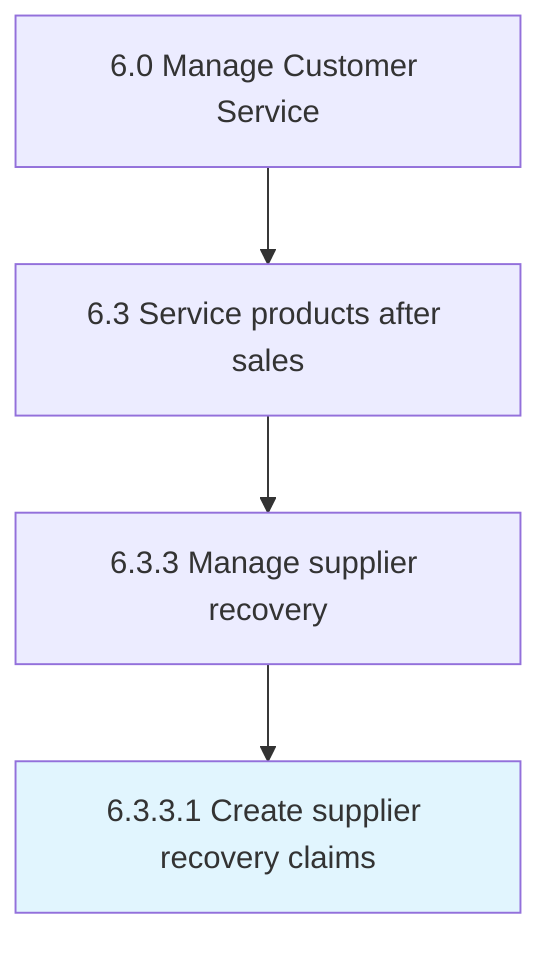

# Create supplier recovery claims

> Raising a supplier recovery claim.

## Overview

Activity 6.3.3.1 is an activity within the Manage Customer Service framework. 

Raising a supplier recovery claim. This is based off the decision made in Receive investigation result/recommendation for corrective action [20100].

## Process Hierarchy



## Key Statistics

| Metric | Value |
|--------|-------|
| APQC Code | 20107 |
| Hierarchy ID | 6.3.3.1 |
| Level | Activity |
| Parent | [6.3.3](../) |
| Sub-Processes | 0 |


## GraphDL Semantic Structure

```
create.SupplierRecoveryClaims
```

| Component | Value | Description |
|-----------|-------|-------------|
| Verb | `create` | Primary action |
| Object | `supplier recovery claims` | Direct object |


## Related Concepts

- SupplierRecoveryClaims


---

*Source: APQC PCF 20107 (6.3.3.1) - APQC*
