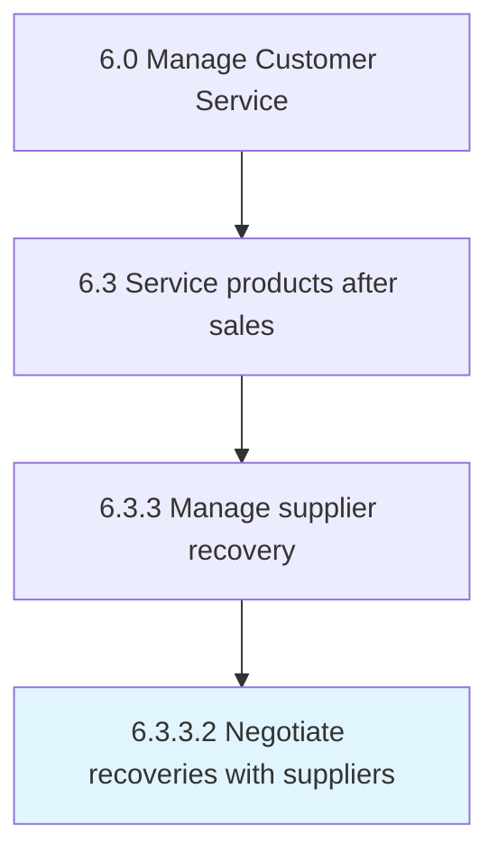

# Negotiate recoveries with suppliers

> Arranging the returns of recalled products to suppliers.

## Overview

Activity 6.3.3.2 is an activity within the Manage Customer Service framework. 

Arranging the returns of recalled products to suppliers.

## Process Hierarchy



## Key Statistics

| Metric | Value |
|--------|-------|
| APQC Code | 20108 |
| Hierarchy ID | 6.3.3.2 |
| Level | Activity |
| Parent | [6.3.3](../) |
| Sub-Processes | 0 |


## GraphDL Semantic Structure

```
negotiate.Recoveries.with.Suppliers
```

| Component | Value | Description |
|-----------|-------|-------------|
| Verb | `negotiate` | Primary action |
| Object | `recoveries` | Direct object |
| Preposition | `with` | Relationship |
| PrepObject | `suppliers` | Indirect object |


## Related Concepts

- [Recoveries](/concepts/Recoveries)
- [Suppliers](/concepts/Suppliers)


---

*Source: APQC PCF 20108 (6.3.3.2) - APQC*
