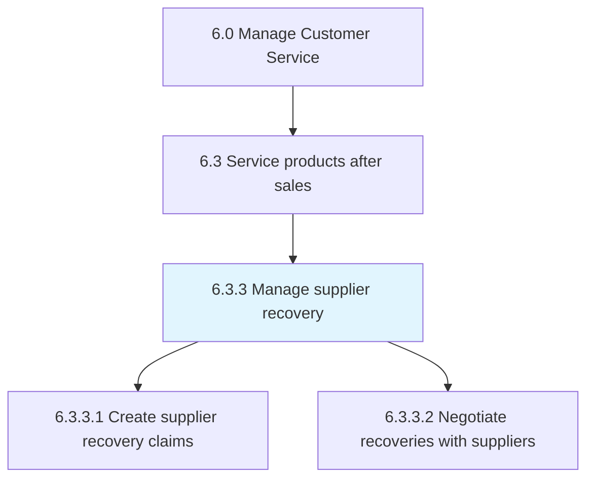
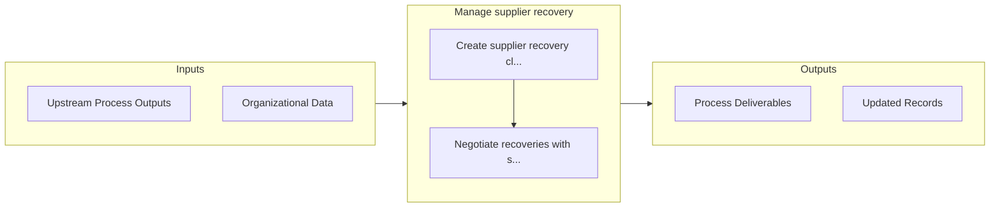

# Manage supplier recovery

> Managing the recovery of costs from suppliers for individual claims.

## Overview

Process 6.3.3 is a core process that defines the specific procedures for manage supplier recovery. 

Managing the recovery of costs from suppliers for individual claims.

## Process Hierarchy



## Key Statistics

| Metric | Value |
|--------|-------|
| APQC Code | 20106 |
| Hierarchy ID | 6.3.3 |
| Level | Process |
| Parent | [6.3](../) |
| Sub-Processes | 2 |


## Process Overview

Customer service processes manage customer inquiries, complaints, and support to ensure customer satisfaction. This process focuses on manage supplier recovery, which is essential for organizational effectiveness and achieving business objectives.

## Key Metrics

| Metric | Description | Target |
|--------|-------------|--------|
| Customer satisfaction score | Measure of customer satisfaction score | Target varies by organization |
| First contact resolution | Measure of first contact resolution | Target varies by organization |
| Average handle time | Measure of average handle time | Target varies by organization |
| Net promoter score | Measure of net promoter score | Target varies by organization |

## Related Departments

- [Customer Service](/departments/Customer Service)
- [Support](/departments/Support)
- [Quality](/departments/Quality)

## Related Occupations

- [Customer Service Managers](/occupations/Management/CustomerServiceManagers)
- [Customer Service Representatives](/occupations/Administrative/CustomerServiceRepresentatives)
- [Quality Assurance Specialists](/occupations/Production/QualityControlInspectors)

## RACI Matrix

| Activity | Responsible | Accountable | Consulted | Informed |
|----------|-------------|-------------|-----------|----------|
| Plan | Process Owner | Manager | Stakeholders | Team |
| Execute | Team | Process Owner | Manager | Stakeholders |
| Monitor | Analyst | Manager | Process Owner | Leadership |
| Improve | Process Owner | Manager | Team | Stakeholders |

## GraphDL Semantic Structure

```graphdl
manage.SupplierRecovery
```

| Component | Value | Description |
|-----------|-------|-------------|
| Verb | `manage` | Primary action |
| Object | `supplier recovery` | Direct object |


## Process Flow



## Sub-Processes

| Process | Hierarchy ID | Description |
|---------|-------------|-------------|
| [Create supplier recovery claims](./CreateSupplierRecoveryClaims) | 6.3.3.1 | Raising a supplier recovery claim |
| [Negotiate recoveries with suppliers](./NegotiateRecoveriesWithSuppliers) | 6.3.3.2 | Arranging the returns of recalled products to suppliers |


## Related Concepts

- SupplierRecovery


---

*Source: APQC PCF 20106 (6.3.3) - APQC*
