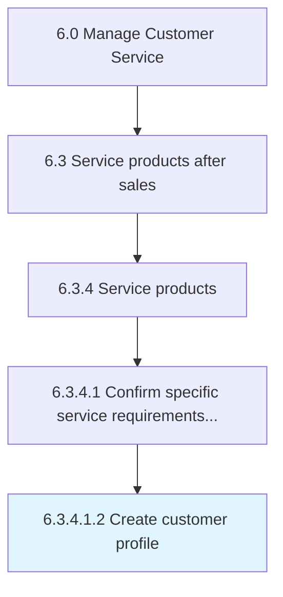

# Create customer profile

> Documenting the individual customer service requirements solicited, along with personal information of the customers, in order to generate customized profiles that hasten the delivery process.

## Overview

Sub-Activity 6.3.4.1.2 is an activity within the Manage Customer Service framework. 

Documenting the individual customer service requirements solicited, along with personal information of the customers, in order to generate customized profiles that hasten the delivery process.

## Process Hierarchy



## Key Statistics

| Metric | Value |
|--------|-------|
| APQC Code | 10325 |
| Hierarchy ID | 6.3.4.1.2 |
| Level | Sub-Activity |
| Parent | [6.3.4.1](../) |
| Sub-Processes | 0 |


## GraphDL Semantic Structure

```
create.CustomerProfile
```

| Component | Value | Description |
|-----------|-------|-------------|
| Verb | `create` | Primary action |
| Object | `customer profile` | Direct object |


## Related Concepts

- [CustomerProfile](/concepts/CustomerProfile)


---

*Source: APQC PCF 10325 (6.3.4.1.2) - APQC*
