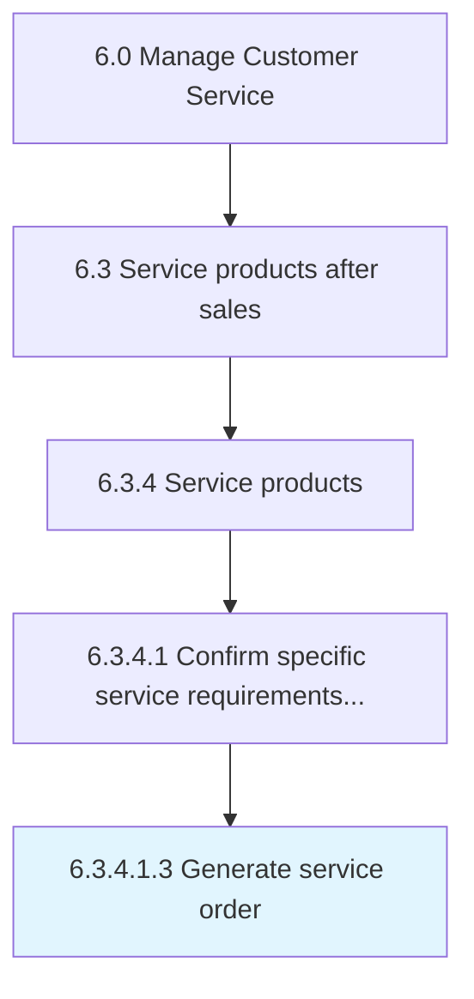

# Generate service order

> Designing a short-term agreement between the service provider and customer.

## Overview

Sub-Activity 6.3.4.1.3 is an activity within the Manage Customer Service framework. 

Designing a short-term agreement between the service provider and customer. One-time services are ordered by the service recipient and resource-related billing is performed upon completion. Use the service order to document service and customer service work.

## Process Hierarchy



## Key Statistics

| Metric | Value |
|--------|-------|
| APQC Code | 10326 |
| Hierarchy ID | 6.3.4.1.3 |
| Level | Sub-Activity |
| Parent | [6.3.4.1](../) |
| Sub-Processes | 0 |


## GraphDL Semantic Structure

```
generate.ServiceOrder
```

| Component | Value | Description |
|-----------|-------|-------------|
| Verb | `generate` | Primary action |
| Object | `service order` | Direct object |


## Related Concepts

- ServiceOrder


---

*Source: APQC PCF 10326 (6.3.4.1.3) - APQC*
