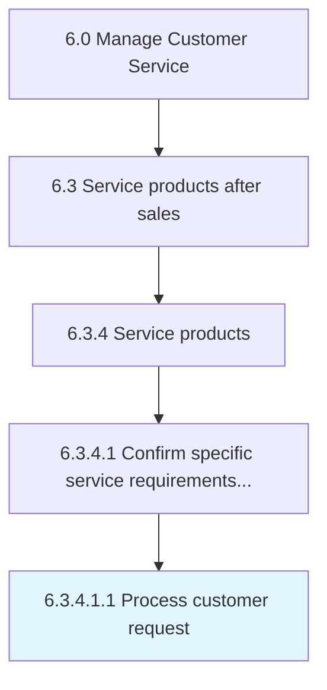

# Process customer request

> Soliciting or acquiring information using various sources such as databases, customer interactions, and customer request forms.

## Overview

Sub-Activity 6.3.4.1.1 is an activity within the Manage Customer Service framework. 

Soliciting or acquiring information using various sources such as databases, customer interactions, and customer request forms. Hand them further up the hierarchy to deal with them. Categorize the user's request, determining if the request is supportable and prioritizing the request.

## Process Hierarchy



## Key Statistics

| Metric | Value |
|--------|-------|
| APQC Code | 10324 |
| Hierarchy ID | 6.3.4.1.1 |
| Level | Sub-Activity |
| Parent | [6.3.4.1](../) |
| Sub-Processes | 0 |


## GraphDL Semantic Structure

```
process.CustomerRequest
```

| Component | Value | Description |
|-----------|-------|-------------|
| Verb | `process` | Primary action |
| Object | `customer request` | Direct object |


## Related Concepts

- [CustomerRequest](/concepts/CustomerRequest)


---

*Source: APQC PCF 10324 (6.3.4.1.1) - APQC*
