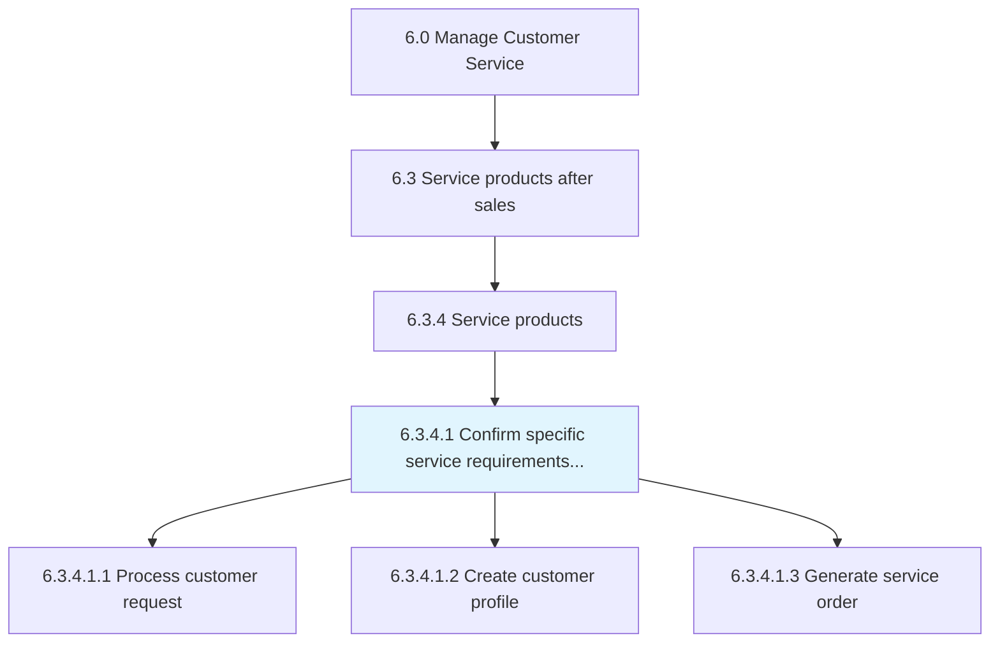
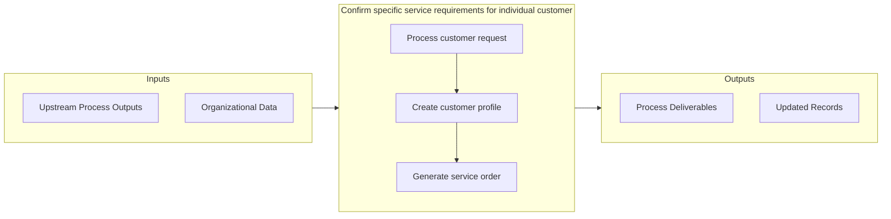

# Confirm specific service requirements for individual customer

> Acquiring or soliciting information about specific service requirements for individual customers through the customer service function.

## Overview

Activity 6.3.4.1 is an activity within the Manage Customer Service framework. 

Acquiring or soliciting information about specific service requirements for individual customers through the customer service function. Obtain information about customer specific requests, process these requests, and create customer profiles to generate a service order.

## Process Hierarchy



## Key Statistics

| Metric | Value |
|--------|-------|
| APQC Code | 10320 |
| Hierarchy ID | 6.3.4.1 |
| Level | Activity |
| Parent | [6.3.4](../) |
| Sub-Processes | 3 |


## GraphDL Semantic Structure

```
confirm.SpecificServiceRequirements.for.IndividualCustomer
```

| Component | Value | Description |
|-----------|-------|-------------|
| Verb | `confirm` | Primary action |
| Object | `specific service requirements` | Direct object |
| Preposition | `for` | Relationship |
| PrepObject | `individual customer` | Indirect object |


## Process Flow



## Sub-Processes

| Process | Hierarchy ID | Description |
|---------|-------------|-------------|
| [Process customer request](./ProcessCustomerRequest) | 6.3.4.1.1 | Soliciting or acquiring information using various sources such as databases, customer interactions,  |
| [Create customer profile](./CreateCustomerProfile) | 6.3.4.1.2 | Documenting the individual customer service requirements solicited, along with personal information  |
| [Generate service order](./GenerateServiceOrder) | 6.3.4.1.3 | Designing a short-term agreement between the service provider and customer |


## Related Concepts

- [SpecificServiceRequirements](/concepts/SpecificServiceRequirements)
- [IndividualCustomer](/concepts/IndividualCustomer)


---

*Source: APQC PCF 10320 (6.3.4.1) - APQC*
