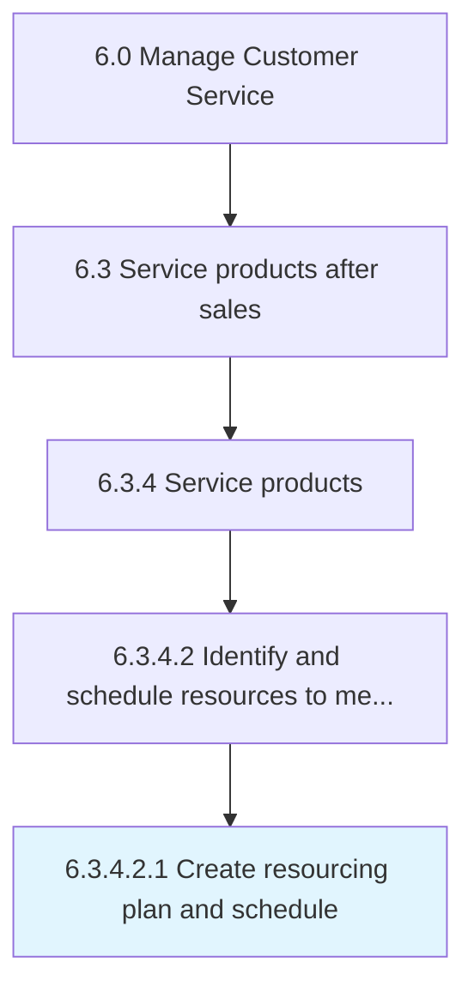

# Create resourcing plan and schedule

> Developing a plan for sourcing and deploying the resources required to fulfill customer service needs.

## Overview

Sub-Activity 6.3.4.2.1 is an activity within the Manage Customer Service framework. 

Developing a plan for sourcing and deploying the resources required to fulfill customer service needs. Document a detailed summary of all types of resources (equipment, finance, personnel, time, etc.) required to complete customer service requests and procure these resources. Identify and assess various sources in order to effectively create a resourcing plan.

## Process Hierarchy



## Key Statistics

| Metric | Value |
|--------|-------|
| APQC Code | 10327 |
| Hierarchy ID | 6.3.4.2.1 |
| Level | Sub-Activity |
| Parent | [6.3.4.2](../) |
| Sub-Processes | 0 |


## GraphDL Semantic Structure

```
create.ResourcingPlanAndSchedule
```

| Component | Value | Description |
|-----------|-------|-------------|
| Verb | `create` | Primary action |
| Object | `resourcing plan and schedule` | Direct object |


## Related Concepts

- [ResourcingPlan](/concepts/ResourcingPlan)
- [Schedule](/concepts/Schedule)


---

*Source: APQC PCF 10327 (6.3.4.2.1) - APQC*
