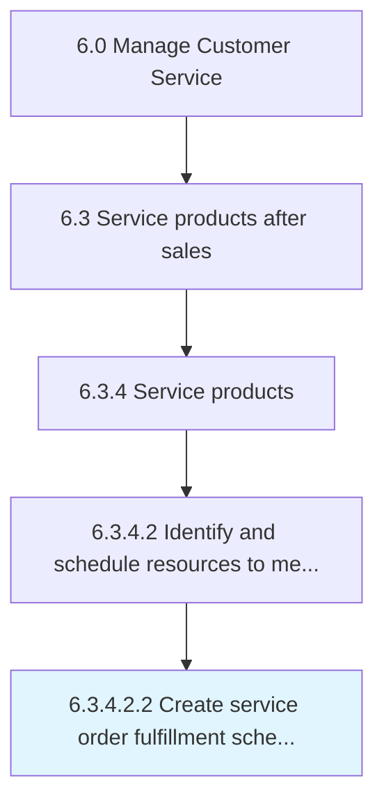

# Create service order fulfillment schedule

> Designing a detailed summary of customer service order requirements, along with information concerning the timing and duration for these services.

## Overview

Sub-Activity 6.3.4.2.2 is an activity within the Manage Customer Service framework. 

Designing a detailed summary of customer service order requirements, along with information concerning the timing and duration for these services. Categorize the customer needs. Monitor the services delivered.

## Process Hierarchy



## Key Statistics

| Metric | Value |
|--------|-------|
| APQC Code | 10328 |
| Hierarchy ID | 6.3.4.2.2 |
| Level | Sub-Activity |
| Parent | [6.3.4.2](../) |
| Sub-Processes | 0 |


## GraphDL Semantic Structure

```
create.ServiceOrderFulfillmentSchedule
```

| Component | Value | Description |
|-----------|-------|-------------|
| Verb | `create` | Primary action |
| Object | `service order fulfillment schedule` | Direct object |


## Related Concepts

- [ServiceOrderFulfillmentSchedule](/concepts/ServiceOrderFulfillmentSchedule)


---

*Source: APQC PCF 10328 (6.3.4.2.2) - APQC*
