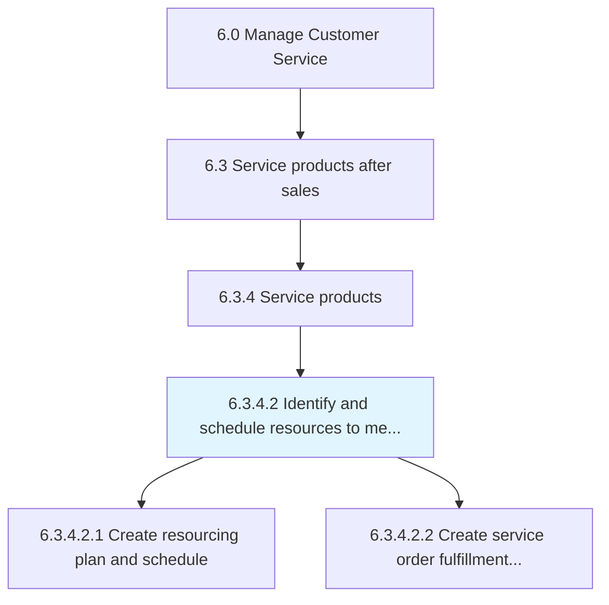
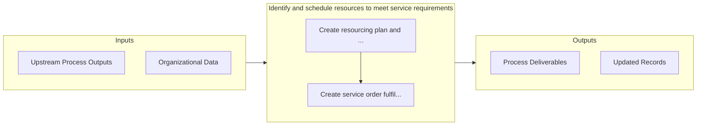

# Identify and schedule resources to meet service requirements

> Determining and scheduling the resources required to fulfill customer service requirements.

## Overview

Activity 6.3.4.2 is an activity within the Manage Customer Service framework. 

Determining and scheduling the resources required to fulfill customer service requirements. Create a detailed schedule about the service orders and development of these service orders.

## Process Hierarchy



## Key Statistics

| Metric | Value |
|--------|-------|
| APQC Code | 10321 |
| Hierarchy ID | 6.3.4.2 |
| Level | Activity |
| Parent | [6.3.4](../) |
| Sub-Processes | 2 |


## GraphDL Semantic Structure

```
identify.AndScheduleResources.to.MeetServiceRequirements
```

| Component | Value | Description |
|-----------|-------|-------------|
| Verb | `identify` | Primary action |
| Object | `and schedule resources` | Direct object |
| Preposition | `to` | Relationship |
| PrepObject | `meet service requirements` | Indirect object |


## Process Flow



## Sub-Processes

| Process | Hierarchy ID | Description |
|---------|-------------|-------------|
| [Create resourcing plan and schedule](./CreateResourcingPlanAndSchedule) | 6.3.4.2.1 | Developing a plan for sourcing and deploying the resources required to fulfill customer service need |
| [Create service order fulfillment schedule](./CreateServiceOrderFulfillmentSchedule) | 6.3.4.2.2 | Designing a detailed summary of customer service order requirements, along with information concerni |


## Related Concepts

- [Resources](/concepts/Resources)
- [MeetServiceRequirements](/concepts/MeetServiceRequirements)
- [Resources](/concepts/Resources)
- [MeetServiceRequirements](/concepts/MeetServiceRequirements)


---

*Source: APQC PCF 10321 (6.3.4.2) - APQC*
