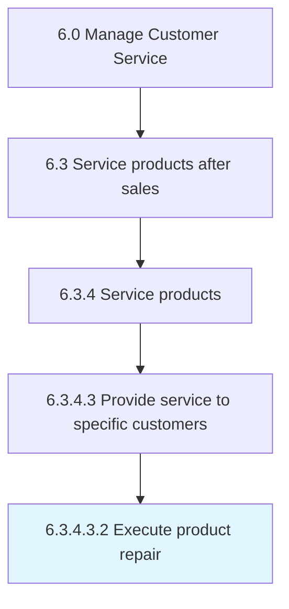

# Execute product repair

> Dispatching and delivering the resources needed for the specific service requirements from the source/warehouse.

## Overview

Sub-Activity 6.3.4.3.2 is an activity within the Manage Customer Service framework. 

Dispatching and delivering the resources needed for the specific service requirements from the source/warehouse. Manage the dispatch, transportation, and delivery of the services.

## Process Hierarchy



## Key Statistics

| Metric | Value |
|--------|-------|
| APQC Code | 10331 |
| Hierarchy ID | 6.3.4.3.2 |
| Level | Sub-Activity |
| Parent | [6.3.4.3](../) |
| Sub-Processes | 0 |


## GraphDL Semantic Structure

```
execute.ProductRepair
```

| Component | Value | Description |
|-----------|-------|-------------|
| Verb | `execute` | Primary action |
| Object | `product repair` | Direct object |


## Related Concepts

- [ProductRepair](/concepts/ProductRepair)


---

*Source: APQC PCF 10331 (6.3.4.3.2) - APQC*
