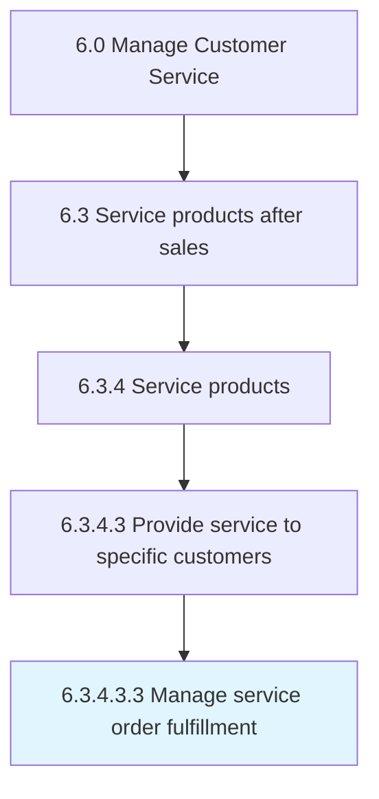

# Manage service order fulfillment

> Handling and managing orders fulfilled, along with the orders are not or partially fulfilled to track the order fulfillment progress.

## Overview

Sub-Activity 6.3.4.3.3 is an activity within the Manage Customer Service framework. 

Handling and managing orders fulfilled, along with the orders are not or partially fulfilled to track the order fulfillment progress. Use electronic devices such as trackers and GPS in order track and ensure delivery of the orders.

## Process Hierarchy



## Key Statistics

| Metric | Value |
|--------|-------|
| APQC Code | 10332 |
| Hierarchy ID | 6.3.4.3.3 |
| Level | Sub-Activity |
| Parent | [6.3.4.3](../) |
| Sub-Processes | 0 |


## GraphDL Semantic Structure

```
manage.ServiceOrderFulfillment
```

| Component | Value | Description |
|-----------|-------|-------------|
| Verb | `manage` | Primary action |
| Object | `service order fulfillment` | Direct object |


## Related Concepts

- [ServiceOrderFulfillment](/concepts/ServiceOrderFulfillment)


---

*Source: APQC PCF 10332 (6.3.4.3.3) - APQC*
