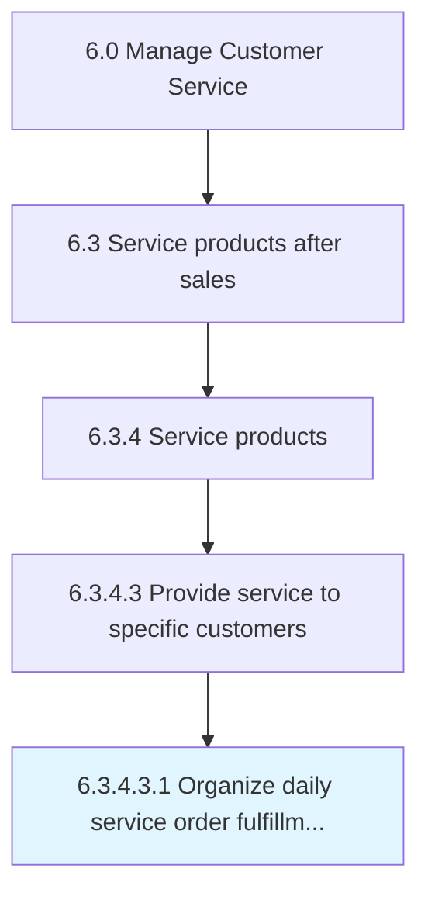

# Organize daily service order fulfillment schedule

> Laying out a daily plan of specific service orders that need to be fulfilled.

## Overview

Sub-Activity 6.3.4.3.1 is an activity within the Manage Customer Service framework. 

Laying out a daily plan of specific service orders that need to be fulfilled. Document and systematically order these activities to ensure high effectiveness and efficiency.

## Process Hierarchy



## Key Statistics

| Metric | Value |
|--------|-------|
| APQC Code | 10330 |
| Hierarchy ID | 6.3.4.3.1 |
| Level | Sub-Activity |
| Parent | [6.3.4.3](../) |
| Sub-Processes | 0 |


## GraphDL Semantic Structure

```
organize.DailyServiceOrderFulfillmentSchedule
```

| Component | Value | Description |
|-----------|-------|-------------|
| Verb | `organize` | Primary action |
| Object | `daily service order fulfillment schedule` | Direct object |


## Related Concepts

- DailyServiceOrderFulfillmentSchedule


---

*Source: APQC PCF 10330 (6.3.4.3.1) - APQC*
