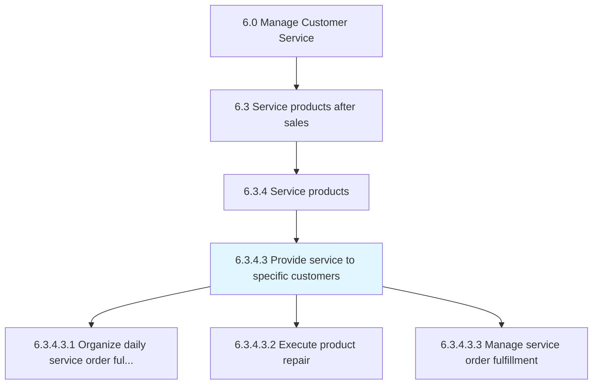
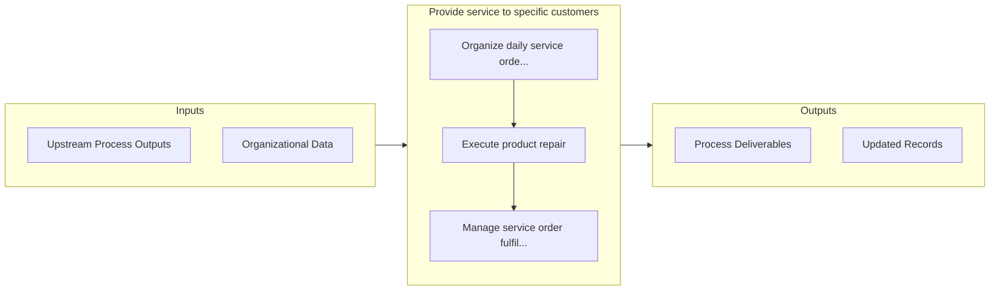

# Provide service to specific customers

> Dispatching resources for managing and fulfilling daily service requirements.

## Overview

Activity 6.3.4.3 is an activity within the Manage Customer Service framework. 

Dispatching resources for managing and fulfilling daily service requirements. Manage the progress of order fulfillment. Complete order blocks.

## Process Hierarchy



## Key Statistics

| Metric | Value |
|--------|-------|
| APQC Code | 10322 |
| Hierarchy ID | 6.3.4.3 |
| Level | Activity |
| Parent | [6.3.4](../) |
| Sub-Processes | 3 |


## GraphDL Semantic Structure

```
provide.Service.to.SpecificCustomers
```

| Component | Value | Description |
|-----------|-------|-------------|
| Verb | `provide` | Primary action |
| Object | `service` | Direct object |
| Preposition | `to` | Relationship |
| PrepObject | `specific customers` | Indirect object |


## Process Flow



## Sub-Processes

| Process | Hierarchy ID | Description |
|---------|-------------|-------------|
| [Organize daily service order fulfillment schedule](./OrganizeDailyServiceOrderFulfillmentSchedule) | 6.3.4.3.1 | Laying out a daily plan of specific service orders that need to be fulfilled |
| [Execute product repair](./ExecuteProductRepair) | 6.3.4.3.2 | Dispatching and delivering the resources needed for the specific service requirements from the sourc |
| [Manage service order fulfillment](./ManageServiceOrderFulfillment) | 6.3.4.3.3 | Handling and managing orders fulfilled, along with the orders are not or partially fulfilled to trac |


## Related Concepts

- Service
- SpecificCustomers


---

*Source: APQC PCF 10322 (6.3.4.3) - APQC*
