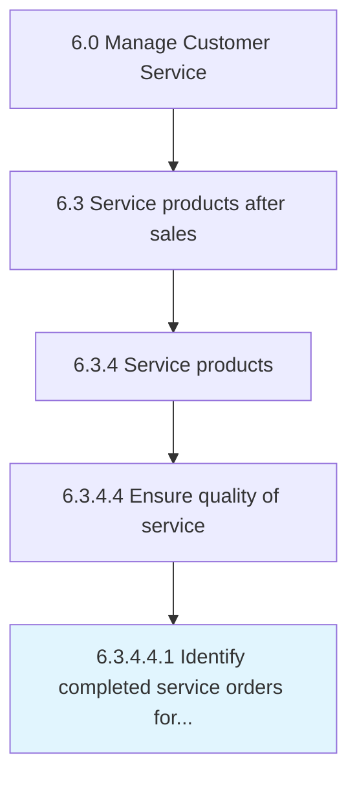

# Identify completed service orders for feedback

> Determining the service orders that have been successfully delivered.

## Overview

Sub-Activity 6.3.4.4.1 is an activity within the Manage Customer Service framework. 

Determining the service orders that have been successfully delivered. Identify the service orders completed and delivered to the customer. Leverage communication systems to ensure coordination with the customers in order to avoid mishaps.

## Process Hierarchy



## Key Statistics

| Metric | Value |
|--------|-------|
| APQC Code | 10334 |
| Hierarchy ID | 6.3.4.4.1 |
| Level | Sub-Activity |
| Parent | [6.3.4.4](../) |
| Sub-Processes | 0 |


## GraphDL Semantic Structure

```
identify.CompletedServiceOrders.for.Feedback
```

| Component | Value | Description |
|-----------|-------|-------------|
| Verb | `identify` | Primary action |
| Object | `completed service orders` | Direct object |
| Preposition | `for` | Relationship |
| PrepObject | `feedback` | Indirect object |


## Related Concepts

- CompletedServiceOrders
- Feedback


---

*Source: APQC PCF 10334 (6.3.4.4.1) - APQC*
