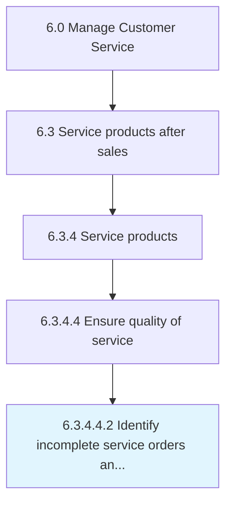

# Identify incomplete service orders and service failures

> Determining orders which have not been completed or delivered.

## Overview

Sub-Activity 6.3.4.4.2 is an activity within the Manage Customer Service framework. 

Determining orders which have not been completed or delivered. Identify the service orders that are partially or entirely incomplete, as well as the orders that have not been delivered to the customer. Use techniques such as project trackers to recognize the progress of the service orders.

## Process Hierarchy



## Key Statistics

| Metric | Value |
|--------|-------|
| APQC Code | 10335 |
| Hierarchy ID | 6.3.4.4.2 |
| Level | Sub-Activity |
| Parent | [6.3.4.4](../) |
| Sub-Processes | 0 |


## GraphDL Semantic Structure

```
identify.IncompleteServiceOrdersAndServiceFailures
```

| Component | Value | Description |
|-----------|-------|-------------|
| Verb | `identify` | Primary action |
| Object | `incomplete service orders and service failures` | Direct object |


## Related Concepts

- IncompleteServiceOrders
- ServiceFailures


---

*Source: APQC PCF 10335 (6.3.4.4.2) - APQC*
