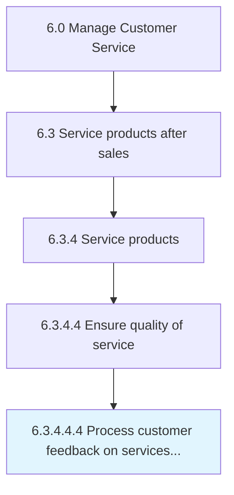

# Process customer feedback on services delivered

> Assessing and incorporating customer reviews/feedback into the service plan to ensure high quality of service.

## Overview

Sub-Activity 6.3.4.4.4 is an activity within the Manage Customer Service framework. 

Assessing and incorporating customer reviews/feedback into the service plan to ensure high quality of service.

## Process Hierarchy



## Key Statistics

| Metric | Value |
|--------|-------|
| APQC Code | 10337 |
| Hierarchy ID | 6.3.4.4.4 |
| Level | Sub-Activity |
| Parent | [6.3.4.4](../) |
| Sub-Processes | 0 |


## GraphDL Semantic Structure

```
process.CustomerFeedback.on.ServicesDelivered
```

| Component | Value | Description |
|-----------|-------|-------------|
| Verb | `process` | Primary action |
| Object | `customer feedback` | Direct object |
| Preposition | `on` | Relationship |
| PrepObject | `services delivered` | Indirect object |


## Related Concepts

- CustomerFeedback
- ServicesDelivered


---

*Source: APQC PCF 10337 (6.3.4.4.4) - APQC*
