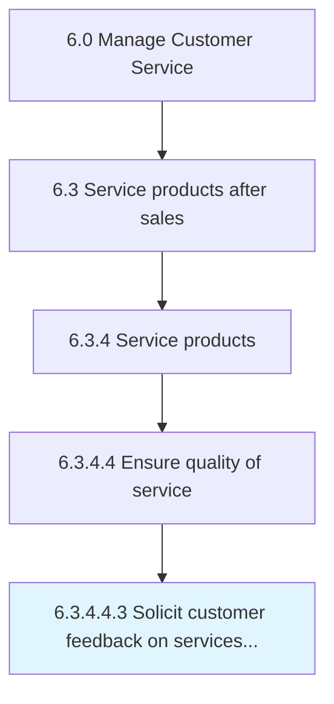

# Solicit customer feedback on services delivered

> Obtaining and procuring customer reviews or feedback on the services delivered.

## Overview

Sub-Activity 6.3.4.4.3 is an activity within the Manage Customer Service framework. 

Obtaining and procuring customer reviews or feedback on the services delivered. Design a customer feedback form, or communicate with the customer through the phone or online.

## Process Hierarchy



## Key Statistics

| Metric | Value |
|--------|-------|
| APQC Code | 10336 |
| Hierarchy ID | 6.3.4.4.3 |
| Level | Sub-Activity |
| Parent | [6.3.4.4](../) |
| Sub-Processes | 0 |


## GraphDL Semantic Structure

```
solicit.CustomerFeedback.on.ServicesDelivered
```

| Component | Value | Description |
|-----------|-------|-------------|
| Verb | `solicit` | Primary action |
| Object | `customer feedback` | Direct object |
| Preposition | `on` | Relationship |
| PrepObject | `services delivered` | Indirect object |


## Related Concepts

- [CustomerFeedback](/concepts/CustomerFeedback)
- [ServicesDelivered](/concepts/ServicesDelivered)


---

*Source: APQC PCF 10336 (6.3.4.4.3) - APQC*
