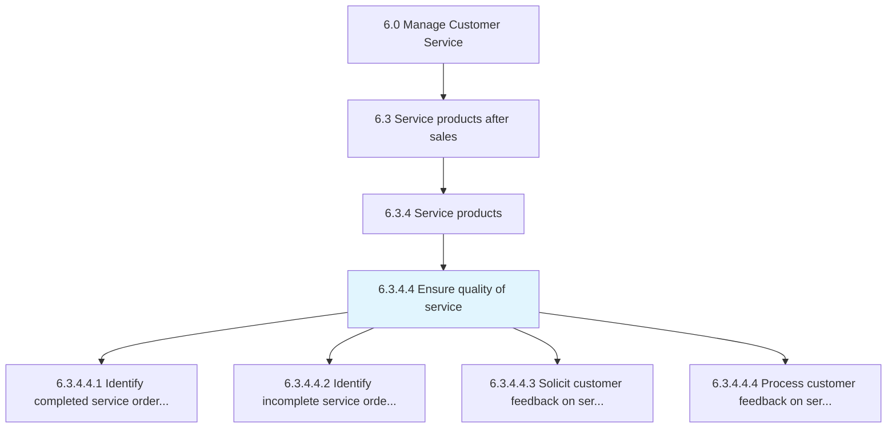
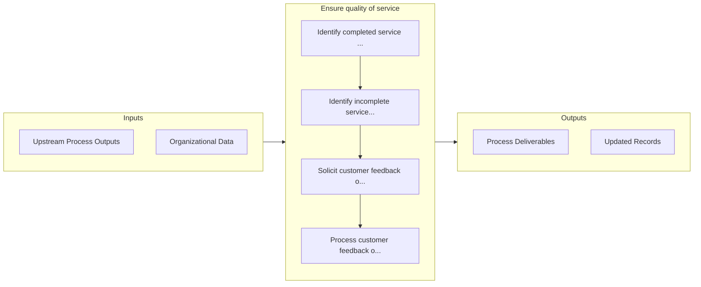

# Ensure quality of service

> Guaranteeing the quality of service provided to customers.

## Overview

Activity 6.3.4.4 is an activity within the Manage Customer Service framework. 

Guaranteeing the quality of service provided to customers. Identify the successful and unsuccessful orders along with the service failures. Collect customer feedback. Process the feedback to ensure the quality of service in the future.

## Process Hierarchy



## Key Statistics

| Metric | Value |
|--------|-------|
| APQC Code | 10323 |
| Hierarchy ID | 6.3.4.4 |
| Level | Activity |
| Parent | [6.3.4](../) |
| Sub-Processes | 4 |


## GraphDL Semantic Structure

```
ensure.Quality.of.Service
```

| Component | Value | Description |
|-----------|-------|-------------|
| Verb | `ensure` | Primary action |
| Object | `quality` | Direct object |
| Preposition | `of` | Relationship |
| PrepObject | `service` | Indirect object |


## Process Flow



## Sub-Processes

| Process | Hierarchy ID | Description |
|---------|-------------|-------------|
| [Identify completed service orders for feedback](./IdentifyCompletedServiceOrdersForFeedback) | 6.3.4.4.1 | Determining the service orders that have been successfully delivered |
| [Identify incomplete service orders and service failures](./IdentifyIncompleteServiceOrdersAndServiceFailures) | 6.3.4.4.2 | Determining orders which have not been completed or delivered |
| [Solicit customer feedback on services delivered](./SolicitCustomerFeedbackOnServicesDelivered) | 6.3.4.4.3 | Obtaining and procuring customer reviews or feedback on the services delivered |
| [Process customer feedback on services delivered](./ProcessCustomerFeedbackOnServicesDelivered) | 6.3.4.4.4 | Assessing and incorporating customer reviews/feedback into the service plan to ensure high quality o |


## Related Concepts

- [Quality](/concepts/Quality)
- [Service](/concepts/Service)


---

*Source: APQC PCF 10323 (6.3.4.4) - APQC*
