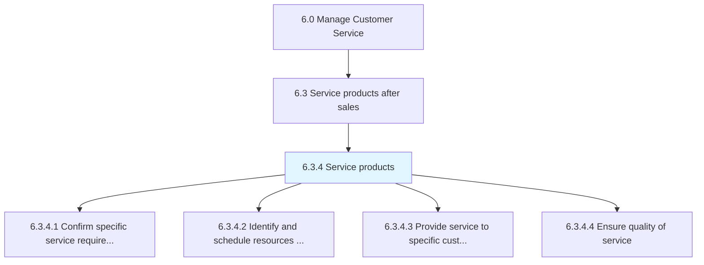
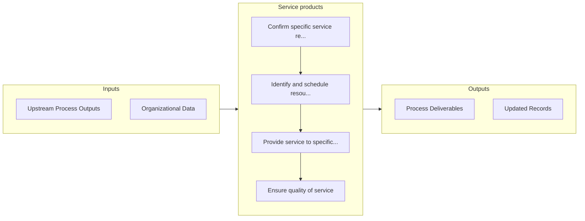

# Service products

> Validating specific service requirements for individual customers.

## Overview

Process 6.3.4 is a core process that defines the specific procedures for service products. 

Validating specific service requirements for individual customers. Determine and schedule resource to fulfill these requirements. Provide service to specific individual customers. Ensure the quality of service delivery.

## Process Hierarchy



## Key Statistics

| Metric | Value |
|--------|-------|
| APQC Code | 10218 |
| Hierarchy ID | 6.3.4 |
| Level | Process |
| Parent | [6.3](../) |
| Sub-Processes | 4 |


## GraphDL Semantic Structure

```
service.Products
```

| Component | Value | Description |
|-----------|-------|-------------|
| Verb | `service` | Primary action |
| Object | `products` | Direct object |


## Process Flow



## Sub-Processes

| Process | Hierarchy ID | Description |
|---------|-------------|-------------|
| [Confirm specific service requirements for individual customer](./6.3.4.1-ConfirmSpecificServiceRequirements/) | 6.3.4.1 | Acquiring or soliciting information about specific service requirements for individual customers thr |
| [Identify and schedule resources to meet service requirements](./6.3.4.2-IdentifyScheduleResourcesMeet/) | 6.3.4.2 | Determining and scheduling the resources required to fulfill customer service requirements |
| [Provide service to specific customers](./6.3.4.3-ProvideServiceSpecificCustomers/) | 6.3.4.3 | Dispatching resources for managing and fulfilling daily service requirements |
| [Ensure quality of service](./6.3.4.4-EnsureQualityService/) | 6.3.4.4 | Guaranteeing the quality of service provided to customers |


## Related Concepts

- Products


---

*Source: APQC PCF 10218 (6.3.4) - APQC*
