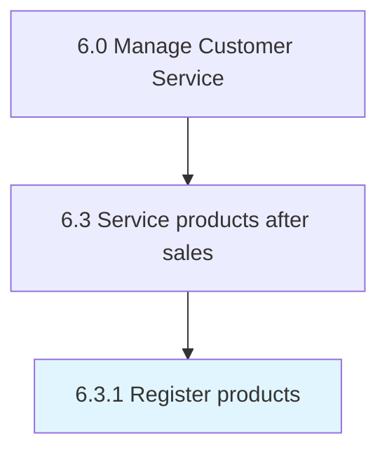

# Register products

> Filing product registrations.

## Overview

Process 6.3.1 is a core process that defines the specific procedures for register products. 

## Process Hierarchy



## Key Statistics

| Metric | Value |
|--------|-------|
| APQC Code | 20605 |
| Hierarchy ID | 6.3.1 |
| Level | Process |
| Parent | [6.3](../) |
| Sub-Processes | 0 |


## GraphDL Semantic Structure

```
register.Products
```

| Component | Value | Description |
|-----------|-------|-------------|
| Verb | `register` | Primary action |
| Object | `products` | Direct object |


## Related Concepts

- [Products](/concepts/Products)


---

*Source: APQC PCF 20605 (6.3.1) - APQC*
