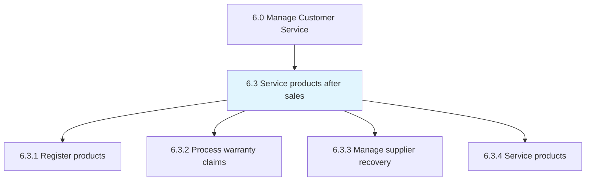
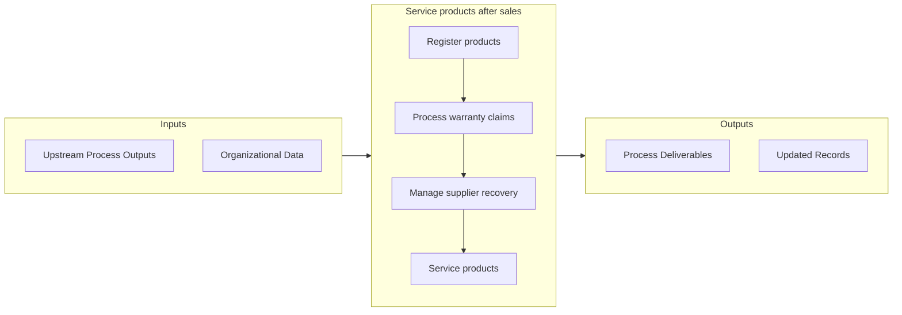

# Service products after sales

> Assigning post-sales policies and paying claims on purchased products.

## Overview

Group 6.3 is a process group within APQC Category 6.0 (Manage Customer Service). 

Assigning post-sales policies and paying claims on purchased products. This is a process that is an administrative function focused on creating rules (claim codes). This group ensures that claims are valid and are processed quickly. As well as to quickly determine responsibility for claim settlement.

## Process Hierarchy



## Key Statistics

| Metric | Value |
|--------|-------|
| APQC Code | 12658 |
| Hierarchy ID | 6.3 |
| Level | Group |
| Parent | [6](../) |
| Sub-Processes | 4 |


## GraphDL Semantic Structure

```
service.ProductsAfterSales
```

| Component | Value | Description |
|-----------|-------|-------------|
| Verb | `service` | Primary action |
| Object | `products after sales` | Direct object |


## Process Flow



## Sub-Processes

| Process | Hierarchy ID | Description |
|---------|-------------|-------------|
| [Register products](./RegisterProducts) | 6.3.1 | Filing product registrations |
| [Process warranty claims](./6.3.2-ProcessWarrantyClaims/) | 6.3.2 | Identifying, investigating, and processes warranty claims |
| [Manage supplier recovery](./6.3.3-ManageSupplierRecovery/) | 6.3.3 | Managing the recovery of costs from suppliers for individual claims |
| [Service products](./6.3.4-ServiceProducts/) | 6.3.4 | Validating specific service requirements for individual customers |


## Related Concepts

- ProductsAfterSales


---

*Source: APQC PCF 12658 (6.3) - APQC*
