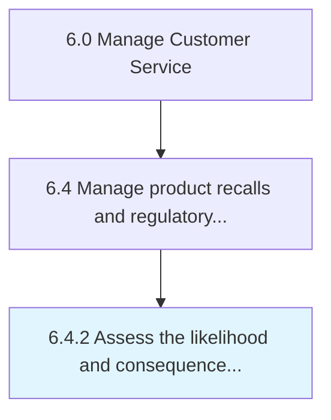

# Assess the likelihood and consequences of occurrence of any hazards

> Performing risk analysis.

## Overview

Process 6.4.2 is a core process that defines the specific procedures for assess the likelihood and consequences of occurrence of any hazards. 

Performing risk analysis. Identify all dangers, evaluate how probable they are, and what kinds of negative results or or adverse side effect they carry.

## Process Hierarchy



## Key Statistics

| Metric | Value |
|--------|-------|
| APQC Code | 20112 |
| Hierarchy ID | 6.4.2 |
| Level | Process |
| Parent | [6.4](../) |
| Sub-Processes | 0 |


## GraphDL Semantic Structure

```
assess.TheLikelihoodAndConsequences.of.OccurrenceOfAnyHazards
```

| Component | Value | Description |
|-----------|-------|-------------|
| Verb | `assess` | Primary action |
| Object | `the likelihood and consequences` | Direct object |
| Preposition | `of` | Relationship |
| PrepObject | `occurrence of any hazards` | Indirect object |


## Related Concepts

- [Likelihood](/concepts/Likelihood)
- [OccurrenceOfHazards](/concepts/OccurrenceOfHazards)
- [Consequences](/concepts/Consequences)
- [OccurrenceOfHazards](/concepts/OccurrenceOfHazards)


---

*Source: APQC PCF 20112 (6.4.2) - APQC*
