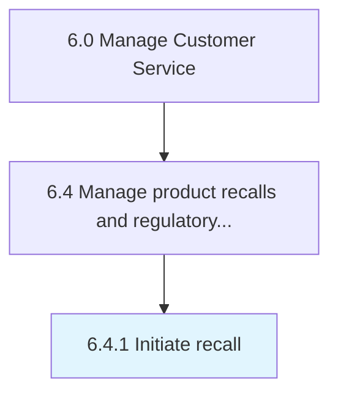

# Initiate recall

> Commencing the removal process of defective products.

## Overview

Process 6.4.1 is a core process that defines the specific procedures for initiate recall. 

Commencing the removal process of defective products.

## Process Hierarchy



## Key Statistics

| Metric | Value |
|--------|-------|
| APQC Code | 20111 |
| Hierarchy ID | 6.4.1 |
| Level | Process |
| Parent | [6.4](../) |
| Sub-Processes | 0 |


## GraphDL Semantic Structure

```
initiate.Recall
```

| Component | Value | Description |
|-----------|-------|-------------|
| Verb | `initiate` | Primary action |
| Object | `recall` | Direct object |


## Related Concepts

- Recall


---

*Source: APQC PCF 20111 (6.4.1) - APQC*
