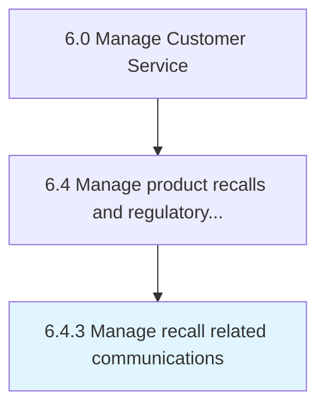

# Manage recall related communications

> Handling communications that are related to product recalls.

## Overview

Process 6.4.3 is a core process that defines the specific procedures for manage recall related communications. 

Handling communications that are related to product recalls.

## Process Hierarchy



## Key Statistics

| Metric | Value |
|--------|-------|
| APQC Code | 20113 |
| Hierarchy ID | 6.4.3 |
| Level | Process |
| Parent | [6.4](../) |
| Sub-Processes | 0 |


## GraphDL Semantic Structure

```
manage.RecallRelatedCommunications
```

| Component | Value | Description |
|-----------|-------|-------------|
| Verb | `manage` | Primary action |
| Object | `recall related communications` | Direct object |


## Related Concepts

- [RecallRelatedCommunications](/concepts/RecallRelatedCommunications)


---

*Source: APQC PCF 20113 (6.4.3) - APQC*
