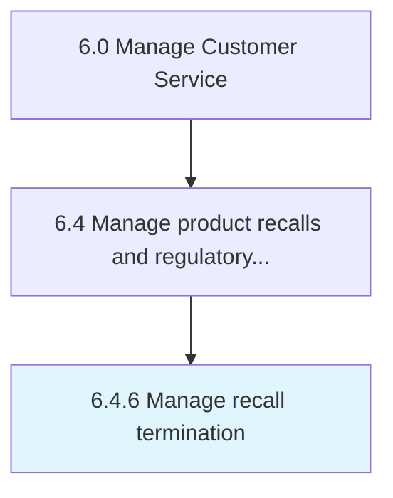

# Manage recall termination

> Ending product recalls, communicating to the public and filing reports.

## Overview

Process 6.4.6 is a core process that defines the specific procedures for manage recall termination. 

Ending product recalls, communicating to the public and filing reports.

## Process Hierarchy



## Key Statistics

| Metric | Value |
|--------|-------|
| APQC Code | 20116 |
| Hierarchy ID | 6.4.6 |
| Level | Process |
| Parent | [6.4](../) |
| Sub-Processes | 0 |


## GraphDL Semantic Structure

```
manage.RecallTermination
```

| Component | Value | Description |
|-----------|-------|-------------|
| Verb | `manage` | Primary action |
| Object | `recall termination` | Direct object |


## Related Concepts

- [RecallTermination](/concepts/RecallTermination)


---

*Source: APQC PCF 20116 (6.4.6) - APQC*
