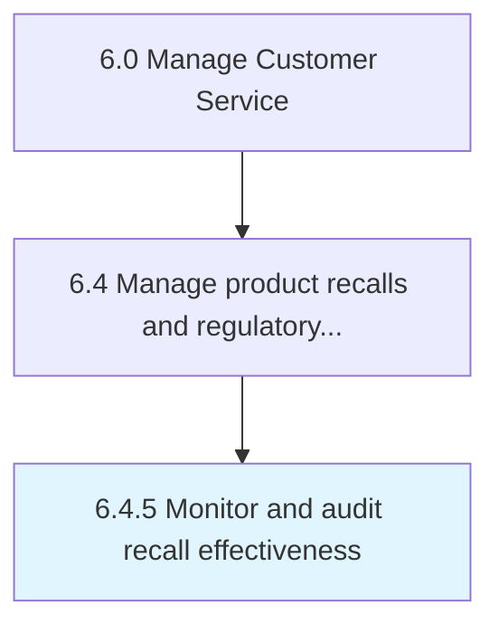

# Monitor and audit recall effectiveness

> Analyzing the effectiveness of product recalls.

## Overview

Process 6.4.5 is a core process that defines the specific procedures for monitor and audit recall effectiveness. 

## Process Hierarchy



## Key Statistics

| Metric | Value |
|--------|-------|
| APQC Code | 20115 |
| Hierarchy ID | 6.4.5 |
| Level | Process |
| Parent | [6.4](../) |
| Sub-Processes | 0 |


## GraphDL Semantic Structure

```
monitor.AndAuditRecallEffectiveness
```

| Component | Value | Description |
|-----------|-------|-------------|
| Verb | `monitor` | Primary action |
| Object | `and audit recall effectiveness` | Direct object |


## Related Concepts

- [RecallEffectiveness](/concepts/RecallEffectiveness)
- [RecallEffectiveness](/concepts/RecallEffectiveness)


---

*Source: APQC PCF 20115 (6.4.5) - APQC*
