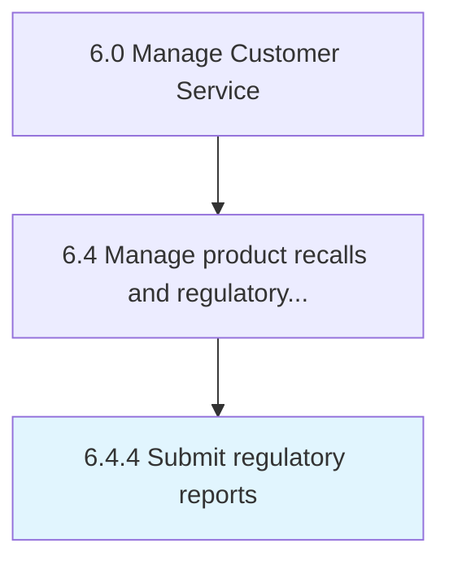

# Submit regulatory reports

> Creating and delivering reports to regulatory agencies to provide details about handling product recalls.

## Overview

Process 6.4.4 is a core process that defines the specific procedures for submit regulatory reports. 

Creating and delivering reports to regulatory agencies to provide details about handling product recalls.

## Process Hierarchy



## Key Statistics

| Metric | Value |
|--------|-------|
| APQC Code | 20114 |
| Hierarchy ID | 6.4.4 |
| Level | Process |
| Parent | [6.4](../) |
| Sub-Processes | 0 |


## GraphDL Semantic Structure

```
submit.RegulatoryReports
```

| Component | Value | Description |
|-----------|-------|-------------|
| Verb | `submit` | Primary action |
| Object | `regulatory reports` | Direct object |


## Related Concepts

- [RegulatoryReports](/concepts/RegulatoryReports)


---

*Source: APQC PCF 20114 (6.4.4) - APQC*
