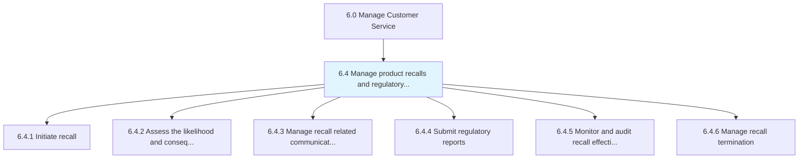
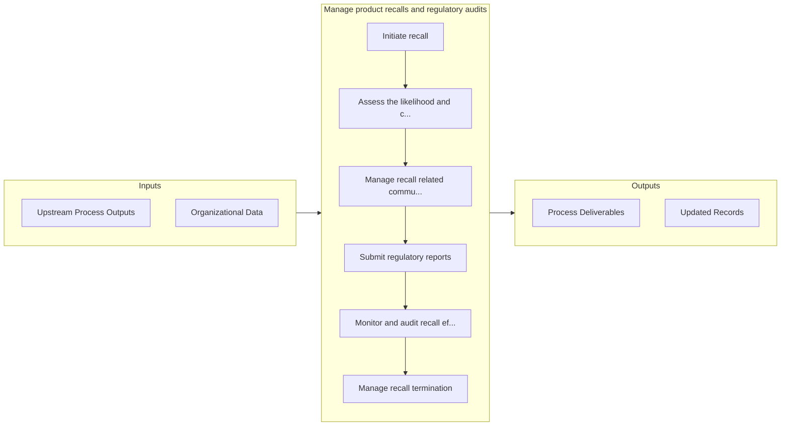

# Manage product recalls and regulatory audits

> Removing defective products from the distribution chain.

## Overview

Group 6.4 is a process group within APQC Category 6.0 (Manage Customer Service). 

Removing defective products from the distribution chain. Participate in audits from watchdog agencies.

## Process Hierarchy



## Key Statistics

| Metric | Value |
|--------|-------|
| APQC Code | 20110 |
| Hierarchy ID | 6.4 |
| Level | Group |
| Parent | [6](../) |
| Sub-Processes | 6 |


## GraphDL Semantic Structure

```
manage.ProductRecallsAndRegulatoryAudits
```

| Component | Value | Description |
|-----------|-------|-------------|
| Verb | `manage` | Primary action |
| Object | `product recalls and regulatory audits` | Direct object |


## Process Flow



## Sub-Processes

| Process | Hierarchy ID | Description |
|---------|-------------|-------------|
| [Initiate recall](./InitiateRecall) | 6.4.1 | Commencing the removal process of defective products |
| [Assess the likelihood and consequences of occurrence of any hazards](./AssessTheLikelihoodAndConsequencesOfOccurrenceOfAnyHazards) | 6.4.2 | Performing risk analysis |
| [Manage recall related communications](./ManageRecallRelatedCommunications) | 6.4.3 | Handling communications that are related to product recalls |
| [Submit regulatory reports](./SubmitRegulatoryReports) | 6.4.4 | Creating and delivering reports to regulatory agencies to provide details about handling product rec |
| [Monitor and audit recall effectiveness](./MonitorAndAuditRecallEffectiveness) | 6.4.5 | Analyzing the effectiveness of product recalls |
| [Manage recall termination](./ManageRecallTermination) | 6.4.6 | Ending product recalls, communicating to the public and filing reports |


## Related Concepts

- [ProductRecallsAudits](/concepts/ProductRecallsAudits)
- [RegulatoryAudits](/concepts/RegulatoryAudits)


---

*Source: APQC PCF 20110 (6.4) - APQC*
