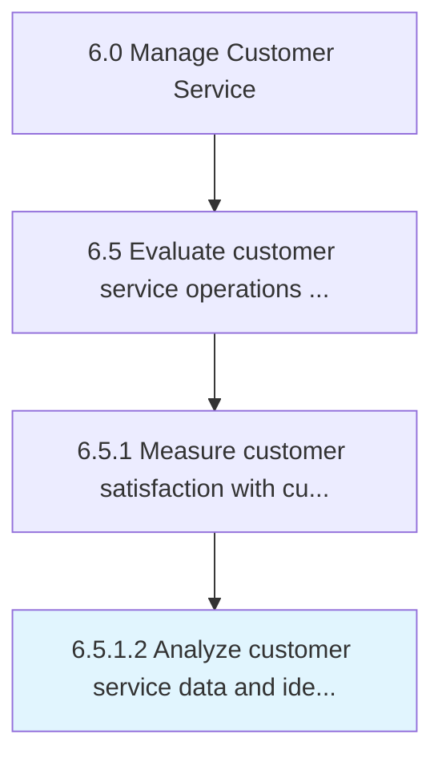

# Analyze customer service data and identify improvement opportunities

> Reviewing customer service feedback to identify areas in which improvements can be made.

## Overview

Activity 6.5.1.2 is an activity within the Manage Customer Service framework. 

Reviewing customer service feedback to identify areas in which improvements can be made. Engage with management to discuss issues.

## Process Hierarchy



## Key Statistics

| Metric | Value |
|--------|-------|
| APQC Code | 11688 |
| Hierarchy ID | 6.5.1.2 |
| Level | Activity |
| Parent | [6.5.1](../) |
| Sub-Processes | 0 |


## GraphDL Semantic Structure

```
analyze.CustomerServiceDataAndIdentifyImprovementOpportunities
```

| Component | Value | Description |
|-----------|-------|-------------|
| Verb | `analyze` | Primary action |
| Object | `customer service data and identify improvement opportunities` | Direct object |


## Related Concepts

- CustomerServiceData
- IdentifyImprovementOpportunities


---

*Source: APQC PCF 11688 (6.5.1.2) - APQC*
